# 0. Foundations: AppSec, Network, Crypto & IAM

**Read this first.** Every other tutorial in this track — [LLM Security](../01_llm_security/tutorial.md),
[Cloud Security](../02_cloud_security/tutorial.md), [MLOps/LLMOps Security](../03_mlops_llmops_security/tutorial.md),
[Security System Design](../04_security_system_design/tutorial.md) — assumes the vocabulary
built here without re-explaining it: the CIA triad, OWASP-Top-10-level AppSec, how TLS/PKI
actually establishes trust, the difference between authentication and authorization, and
STRIDE-style threat modeling. If you already use these terms comfortably, skim for gaps;
if not, this is the doc that makes every later "just add auth and encrypt it" statement
concrete.

## Core Concepts

### The CIA Triad, and the Vocabulary Built On It

Every security requirement decomposes into some combination of three properties, and
naming which one a control actually protects is the first move in any security
conversation:

- **Confidentiality** — only authorized parties can read the data. Broken by an
  over-permissive access grant, an unencrypted channel, or a verbose error message that
  leaks internal state.
- **Integrity** — data or a system's behavior hasn't been tampered with, whether by an
  attacker or an accidental bug. Broken by an unsigned artifact, a missing checksum, or a
  write path with no audit trail.
- **Availability** — the system responds to legitimate requests when it should. Broken by
  a denial-of-service attack, but far more often in practice by an unrelated outage that
  security controls made worse (an overly aggressive rate limiter locking out real users).

Two properties built directly on top of the triad, used constantly in every tutorial that
follows:

- **Defense in depth** — layering multiple, independently imperfect controls so that one
  control failing doesn't mean the system is compromised. A WAF rule, input validation, a
  parameterized query, and least-privileged database credentials are four independent
  layers against the same injection attack — defeating all four is a much higher bar than
  defeating one.
- **Least privilege** — every identity (human, service, or process) holds the minimum
  permissions needed for its actual job, no more. This is the single most load-bearing
  principle in this entire track: nearly every incident in the [scenario bank](../05_scenarios/README.md)
  traces back to a permission grant that was broader than the task required, discovered
  only after something already went wrong.
- **Blast radius** — the scope of damage possible if a given identity, credential, or
  component is fully compromised. Least privilege is the practice; blast radius is the
  number you're trying to minimize. A useful habit for any design question: for every
  credential you introduce, ask "what's the blast radius if this leaks *today*," not just
  "is this credential itself well-protected."
- **Trust boundary** — a line in a system where the level of trust in incoming data or
  requests changes — e.g. the edge between the public internet and your load balancer, or
  between a service and a database it queries. Nearly every vulnerability is a trust
  boundary that was assumed to be somewhere it wasn't; identifying trust boundaries
  explicitly is the starting move of threat modeling, covered below.

### AppSec: The OWASP Top 10, as Categories of Reasoning, Not a List to Memorize

The [OWASP Top 10](https://owasp.org/www-project-top-ten/) is a ranked list of the most
common and impactful web application vulnerability *categories*, refreshed periodically
from real incident data. Reciting the list is a weak interview answer; explaining the
underlying reasoning for each category is a strong one:

| Category | The underlying failure | Concrete example |
|---|---|---|
| **Injection** | Untrusted input is concatenated into a command/query interpreter instead of passed as data | SQL injection via unparameterized query string concatenation |
| **Broken authentication** | Identity isn't verified reliably (weak password policy, no MFA, session fixation) | Credential-stuffing succeeds because there's no rate limit or MFA |
| **Broken access control** | Authentication succeeded, but authorization wasn't (re-)checked per resource | **IDOR** (Insecure Direct Object Reference) — changing `/orders/1234` to `/orders/1235` returns someone else's order because the server checks "is this user logged in," not "does this user own *this* order" |
| **Cryptographic failures** | Sensitive data transmitted or stored without adequate encryption, or encrypted with a broken/misconfigured algorithm | Passwords stored as unsalted MD5 hashes; TLS terminated at a load balancer with plaintext to the backend over an untrusted network |
| **Security misconfiguration** | A secure default was changed, or an insecure default was never changed | A cloud storage bucket left publicly readable; verbose stack traces exposed to end users |
| **Vulnerable/outdated components** | A dependency with a known CVE is still in production | An unpatched library with a public RCE exploit, shipped because there's no dependency-scanning gate |
| **Identification & auth failures** | Session tokens are predictable, don't expire, or survive logout | A JWT with no expiry claim, still valid a year after issuance |
| **Software/data integrity failures** | A pipeline trusts an artifact without verifying its origin | A CI/CD pipeline pulls a package from a mirror with no signature check — the direct analogue of the supply-chain risk covered in [Cloud Security](../02_cloud_security/tutorial.md) and [MLOps/LLMOps Security](../03_mlops_llmops_security/tutorial.md) |
| **Logging & monitoring failures** | An incident happened and there's no record to reconstruct it from | A credential was misused for weeks before anyone noticed, because no alert fired on anomalous access patterns |
| **SSRF (Server-Side Request Forgery)** | The server can be tricked into making a request to an attacker-chosen destination | An "import from URL" feature that fetches `http://169.254.169.254/latest/meta-data/` — the cloud instance metadata endpoint — and returns the response to the attacker; this exact pattern reappears as an **agentic tool-call risk** in [LLM Security](../01_llm_security/tutorial.md) |

The reasoning pattern underneath nearly all ten: **a boundary where trust should have been
re-established wasn't.** Injection re-uses a trust decision (this string is safe to
interpret as code) across a boundary it shouldn't cross; broken access control re-uses a
trust decision (this user is authenticated) for a question it doesn't answer (is this user
authorized for *this specific resource*). Naming that unifying pattern, rather than the ten
items individually, is what signals you understand AppSec rather than memorized a list.

### Network Security: TLS/PKI, Segmentation, Zero Trust

- **TLS** establishes a confidential, tamper-evident channel between two parties who may
  never have communicated before, using asymmetric crypto (below) to agree on a shared
  symmetric key for the actual data transfer — asymmetric operations are too slow to use
  for bulk traffic, so TLS uses them only for the handshake.
- **PKI (Public Key Infrastructure)** is the trust mechanism that makes TLS meaningful: a
  chain of **certificates**, each signed by the issuer above it, rooted in a small set of
  **Certificate Authorities (CAs)** that operating systems and browsers trust by default.
  A server's certificate is only trustworthy because *someone your client already trusts*
  vouched for it — this chain-of-trust reasoning is exactly what **mTLS** (mutual TLS)
  extends to service-to-service auth: both sides present a certificate, so a service can
  cryptographically verify *which* other service is calling it, not just that the channel
  is encrypted.
- **Network segmentation** limits which components can reach which other components at
  the network layer, independent of application-level auth — a compromised web server in
  a properly segmented network still can't directly reach the database's network path
  unless that specific route is explicitly allowed. This is defense in depth applied at
  the infrastructure layer, and it's exactly what [Cloud Security](../02_cloud_security/tutorial.md#core-concepts)
  covers in terms of VPCs, subnets, and security groups.
- **Zero trust** is the architectural response to the observation that network location
  alone ("it's inside our VPC, it must be safe") is a weak trust signal — a compromised
  internal service is just as dangerous as an external attacker if internal traffic isn't
  itself authenticated and authorized. The practical shift: every request is authenticated
  and authorized at the point of use (often via mTLS + a policy check), regardless of
  whether it originated inside or outside the perimeter — "never trust, always verify,"
  not "trust anything already past the firewall."

### Crypto Essentials: What You Actually Need to Reason About

You rarely implement cryptographic primitives yourself in production — the interview bar
is being able to reason about which primitive fits which problem and naming the common
misuse patterns, not deriving RSA:

- **Symmetric encryption** (e.g. AES) — one shared key both encrypts and decrypts. Fast,
  used for bulk data (data at rest, the body of a TLS session after handshake). The hard
  problem it doesn't solve: how do two parties who've never met agree on a shared key
  without an eavesdropper capturing it in transit?
- **Asymmetric encryption** (e.g. RSA, ECC) — a public key encrypts, only the paired
  private key decrypts (or the reverse, for signing). Solves the key-exchange problem
  above, at a real computational cost — which is exactly why TLS uses it only to bootstrap
  a symmetric session key, not for the whole connection.
- **Hashing** (e.g. SHA-256) is **one-way** — it produces a fixed-size digest with no
  feasible way back to the input, and is used for integrity checks (does this artifact
  match its published checksum) and password storage (store the hash, never the
  plaintext). Hashing is *not* encryption — there's no key and no decryption, which is
  precisely why "just hash the password" needs one more step:
- **Salting** — a unique random value appended to each password before hashing, stored
  alongside the hash. Without it, two users with the same password produce identical
  hashes, and an attacker can precompute a **rainbow table** (a lookup of hash → plaintext
  for common passwords) once and reuse it against every account in a breached database.
  Modern password hashing (bcrypt, scrypt, Argon2) builds in salting plus deliberate
  slowness, so brute-forcing even a stolen hash is computationally expensive per guess.
- **Digital signatures** — the asymmetric-key pattern run in reverse: the *private* key
  signs (over a hash of the message, for efficiency), and anyone with the *public* key can
  verify the signature matches — proving both integrity (the content wasn't altered) and
  authenticity (it came from the private key's holder). This is the mechanism behind
  artifact/container image signing, covered in
  [Cloud Security](../02_cloud_security/tutorial.md#core-concepts) and
  [MLOps/LLMOps Security](../03_mlops_llmops_security/tutorial.md#core-concepts) as the
  answer to "how do you know this model/image wasn't tampered with after it was built."
- **Key management** is where crypto actually fails in practice far more often than the
  math: keys hardcoded in source, checked into git history, embedded in a container image,
  or never rotated. A **KMS (Key Management Service)** exists specifically so application
  code never sees a raw key directly — it requests an operation (encrypt/decrypt/sign)
  from the KMS, which performs it and returns the result, keeping the key material inside
  a boundary that's audited and access-controlled independently of the application.

### IAM: Authentication vs. Authorization, and the Protocols That Implement Them

- **Authentication (authN)** answers *"who are you"* — verifying an identity claim.
  **Authorization (authZ)** answers *"what are you allowed to do"* — a completely separate
  question that must be re-evaluated per action, not assumed once authentication succeeds.
  Conflating the two is exactly the root cause of "broken access control" above: a system
  that checks authN once at login and never re-checks authZ per resource is IDOR waiting
  to happen.
- **OAuth 2.0** is an **authorization** delegation protocol — it lets a user grant a
  third-party application limited access to their resources on another service, without
  sharing their password with that application (the "sign in with Google, grant this app
  calendar access" flow). It issues **access tokens** scoped to specific permissions.
- **OIDC (OpenID Connect)** is a thin **authentication** layer built on top of OAuth 2.0 —
  it adds an **ID token** (a signed JWT asserting identity) to OAuth's access-token
  mechanism. The distinction worth stating precisely: OAuth alone tells you *what a token
  can access*; OIDC additionally tells you *who the token belongs to*.
- **SAML** is an older, XML-based protocol for the same authentication problem OIDC
  solves, still common in enterprise SSO — functionally similar goal, heavier format, and
  worth naming as "the enterprise-SSO-era protocol OIDC has mostly displaced for
  new systems" rather than explaining its internals in depth.
- **RBAC (Role-Based Access Control)** grants permissions via a role assigned to an
  identity (e.g. "editor," "admin") — simple to reason about and audit, but coarse: it
  can't natively express "this user can edit documents they own" without exploding into
  many narrow roles.
- **ABAC (Attribute-Based Access Control)** evaluates a policy against *attributes* of the
  request (user department, resource owner, time of day, resource sensitivity tag) at
  decision time — expressive enough for "edit only your own documents during business
  hours," at the cost of policies being harder to audit at a glance than a fixed role
  list. The practical default: **RBAC for coarse system-level permissions, ABAC (or a
  hybrid) when authorization genuinely depends on resource- or context-specific
  attributes** — this maps directly onto the model/feature-store access-control question
  in [MLOps/LLMOps Security](../03_mlops_llmops_security/tutorial.md#core-concepts).
- **JWTs (JSON Web Tokens)** are a signed (not necessarily encrypted) token format used to
  carry authN/authZ claims statelessly — the server verifies the signature instead of
  looking up a session in a datastore. The failure modes worth naming proactively: the
  historical `"alg": "none"` vulnerability (some libraries would accept an unsigned token
  if the header claimed no algorithm was used), algorithm-confusion attacks (tricking a
  server that expects an asymmetric signature into verifying against a symmetric secret it
  can derive from the public key), and simply never checking the expiry claim.

### Threat Modeling: STRIDE and Trust Boundaries

**Threat modeling** is the practice of systematically enumerating what could go wrong in a
system *before* building or reviewing it, rather than reactively patching after an
incident. **STRIDE** is the most common structured checklist for doing this, one letter
per threat category, each mapped to the security property it violates:

| STRIDE Letter | Threat | Property Violated | Example |
|---|---|---|---|
| **S** — Spoofing | Pretending to be something/someone you're not | Authentication | Forging a service's identity to a downstream API with no mTLS check |
| **T** — Tampering | Modifying data or code without authorization | Integrity | Altering a model artifact in a registry with no signature verification |
| **R** — Repudiation | Denying an action was taken, with no way to prove otherwise | Non-repudiation (logging/audit) | A privileged action with no audit log — no one can prove who did it |
| **I** — Information disclosure | Exposing information to unauthorized parties | Confidentiality | A verbose error message leaking a database schema |
| **D** — Denial of service | Degrading or blocking availability | Availability | An unauthenticated endpoint with no rate limit, trivially flooded |
| **E** — Elevation of privilege | Gaining permissions beyond what was granted | Authorization | A confused-deputy bug where a low-privilege user triggers a high-privilege service action on their behalf |

The practical workflow: draw a **data flow diagram** of the system (components, data
stores, and the trust boundaries between them), then walk every element crossing a trust
boundary through all six STRIDE categories, asking "could this happen here, and what
stops it?" This is slower than it sounds the first few times and becomes fast with
repetition — it's the exact method used in the
[Deep-Dive](#deep-dive-stride-walkthrough-on-a-login-flow) below and again as the opening
move of every case study in [Security System Design](../04_security_system_design/tutorial.md).

## Reference Architecture

A minimal three-tier web request, annotated with its trust boundaries — the diagram every
STRIDE walkthrough in this track starts from:

```mermaid
flowchart LR
    Attacker(("Untrusted\nActor")) -.->|"crosses boundary 1"| LB
    subgraph Internet["Untrusted Zone"]
        Attacker
    end
    LB["Load Balancer\n(TLS termination)"] -->|"boundary 2"| App["App Server\n(authN/authZ checks)"]
    App -->|"boundary 3\n(mTLS + least-priv creds)"| DB[("Database")]
    App -->|"boundary 3\n(mTLS + least-priv creds)"| KMS["KMS\n(keys never leave)"]
    App --> Log["Audit Log\n(append-only)"]

    style Internet fill:#3a1414,stroke:#a33
```

Every arrow that crosses a **trust boundary** (an untrusted-to-trusted transition, or a
transition between two components with different privilege levels) is exactly where
STRIDE should be applied: boundary 1 is where spoofing/DoS/tampering from an anonymous
attacker must be handled (rate limiting, TLS, input validation); boundary 2 is where
authentication happens and authorization must be *re-checked per request*, not assumed;
boundary 3 is where least privilege and mTLS bound the blast radius if the app server
itself is ever compromised.

## Deep-Dive: STRIDE Walkthrough on a Login Flow

Applying the checklist concretely, using a standard username/password login endpoint —
the same method scales to any system in this track:

1. **Spoofing** — Can an attacker impersonate a legitimate user? *Threat:* credential
   stuffing using a leaked password list. *Mitigation:* rate limiting per account/IP, MFA,
   and checking submitted passwords against known-breached-password lists at signup.
2. **Tampering** — Can the request or response be altered in transit? *Threat:* a
   man-in-the-middle strips TLS and modifies the login response. *Mitigation:* enforce
   TLS with HSTS (reject any downgrade to plaintext), don't trust client-side validation
   alone.
3. **Repudiation** — If an account is compromised, can you reconstruct what happened?
   *Threat:* no record of login attempts, source IPs, or timestamps. *Mitigation:*
   append-only audit logging of authN events, feeding the monitoring gap covered in
   OWASP's "logging & monitoring failures" category above.
4. **Information disclosure** — Does a failed login leak anything useful to an attacker?
   *Threat:* "invalid password" vs. "no such user" as distinct error messages lets an
   attacker enumerate valid usernames. *Mitigation:* identical generic error message for
   both cases, identical response timing (to prevent a timing side-channel from leaking
   which case occurred).
5. **Denial of service** — Can the login endpoint itself be used to degrade the service?
   *Threat:* deliberately slow password-hashing functions (bcrypt/Argon2, chosen precisely
   to make brute-forcing expensive) become an amplification vector if unrate-limited — an
   attacker submits many login attempts, each cheap for them but expensive for the server
   to hash-and-check. *Mitigation:* per-IP/per-account rate limiting *in front of* the
   expensive hash comparison, not after it.
6. **Elevation of privilege** — Once authenticated, can a user reach permissions beyond
   their own account? *Threat:* the session token or subsequent API calls don't
   re-validate authorization per resource (IDOR again). *Mitigation:* authorization checks
   scoped to the specific resource on every request, never inferred from "they logged in
   successfully."

Notice the pattern: **every mitigation either re-establishes trust at a boundary that was
being assumed, or bounds the blast radius of the boundary failing anyway.** That two-part
frame — "what re-establishes trust here" and "what limits the damage if it doesn't hold" —
is the reusable core of threat modeling, independent of which specific system you're
applying it to.

## Trade-offs

| Decision | Option A | Option B | When to pick which |
|---|---|---|---|
| Access control model | RBAC (role-based) | ABAC (attribute-based) | RBAC for coarse, auditable system-level permissions; ABAC (or hybrid) once authorization genuinely depends on resource ownership or request context |
| Session mechanism | Server-side session (stateful) | JWT (stateless, signed) | Stateful sessions when you need instant revocation (logout must take effect immediately); JWTs when you need to scale authN checks without a shared session store, accepting that revocation before expiry requires an extra mechanism (a blocklist) |
| Encryption placement | TLS terminated at the load balancer, plaintext internally | TLS/mTLS all the way to the service (zero trust) | Terminate-at-edge only within a network you fully trust and control; end-to-end/mTLS once "inside the VPC" isn't itself a strong trust boundary — the default assumption in a zero-trust design |
| Password verification cost | Fast hash (SHA-256) | Deliberately slow hash (bcrypt/Argon2) | Never use a fast general-purpose hash for passwords — always the slow, purpose-built option; the only real "trade-off" is tuning the slowness parameter against acceptable login latency |
| Threat modeling depth | Full STRIDE pass on every component | STRIDE only at trust boundaries and high-value assets | Full pass when the system is new or high-stakes; boundary-focused pass as the practical default once a system is mature, to keep the exercise tractable |

## Failure Modes to Raise Proactively

- **Authorization checked once, not per resource** — the root cause of IDOR: a system
  verifies "this user is logged in" and then trusts every subsequent request, instead of
  re-checking "does this user own *this specific* resource" on each one.
- **A trust boundary was assumed to be somewhere it isn't** — "it's inside our VPC, it
  must be trusted" is the classic version; the zero-trust response is naming explicitly
  which boundaries are real network boundaries vs. which are just where the architecture
  diagram happened to draw a box.
- **Secrets and keys handled outside the KMS boundary** — a raw key or credential ever
  touching application memory, source control, or logs, instead of the application only
  ever requesting an operation *from* a KMS/secrets manager and never seeing key material
  directly.
- **A signature or checksum is generated but never actually verified downstream** — the
  integrity control exists on paper (an artifact is signed) but the consuming system
  doesn't check it before use, which is functionally identical to having no signature at
  all. This exact gap reappears as a named failure mode in
  [MLOps/LLMOps Security](../03_mlops_llmops_security/tutorial.md#failure-modes-to-raise-proactively)
  for model artifacts specifically.
- **Logging exists, but no one alerts on it** — satisfying "logging & monitoring" on paper
  while the actual detection gap (nothing pages a human) remains open; a log no one reads
  provides repudiation-resistance after the fact but doesn't shorten time-to-detection.

## Make It Yours

- Pick one production system you operate: can you name its trust boundaries explicitly,
  and for each one, what re-establishes trust crossing it?
- Where does authorization actually get checked in that system — once at a session/auth
  layer, or per resource on every request? If you're not certain, that uncertainty is
  itself the answer to give in an interview, framed as "here's what I'd verify first."
- If a credential your system uses today leaked in full right now, what's the actual blast
  radius — every resource in the account, or a narrowly scoped set? What would need to
  change to shrink that answer?

## Practice Questions

- Walk through a STRIDE threat model for a password-reset flow (not login) — what's
  different about the threats here, given that a password reset is designed to bypass the
  normal authentication check?
- A code review turns up an internal service calling another internal service with no
  authentication, reasoning "it's all inside our VPC." Argue for or against treating this
  as a finding, and what you'd want to know before deciding.
- Design the key-management approach for a system that needs to encrypt data at rest,
  verify signed artifacts, and issue short-lived service credentials — what's stored in a
  KMS vs. issued directly to services, and why?

## Articulate It: Interview Framing & Vocabulary

### Three Ways to Explain This

- **Unifying-pattern framing (the default for a senior+ round):** "Almost every AppSec
  vulnerability, from injection to IDOR, is the same underlying failure: a trust decision
  made at one boundary got reused across a boundary it doesn't actually cover. I'd rather
  name that pattern than recite the OWASP list, because it's what lets me reason about a
  vulnerability class I haven't seen named before."
- **Two-question framing (good for any threat-modeling discussion):** "For every trust
  boundary I identify, I ask two things: what re-establishes trust crossing it, and what
  limits the blast radius if that control fails anyway. STRIDE is just a checklist for
  making sure I ask both questions systematically instead of only where it's obvious."
- **AuthN-vs-authZ framing (good for access-control-specific questions):** "Authentication
  answers who you are; authorization answers what you're allowed to do, and it has to be
  re-checked per resource, not assumed once authentication succeeds. Almost every broken
  access control bug is authorization quietly borrowing an authentication decision it
  wasn't entitled to."

### Vocabulary Builder

**Technical shorthand — use these instead of over-explaining the concept every time:**

- **trust boundary** (n. phrase) — a point in a system where the level of trust in
  incoming data or requests changes; the starting unit of any threat model.
- **blast radius** (n. phrase) — the scope of damage possible if a given identity,
  credential, or component is fully compromised; the quantity least privilege is trying to
  minimize.
- **IDOR** (n., Insecure Direct Object Reference) — an access-control bug where
  authorization isn't re-checked per resource, letting a user access another user's data
  by changing an identifier in the request.
- **confused deputy** (n. phrase) — a privileged component tricked into misusing its own
  authority on behalf of a less-privileged caller that couldn't have taken the action
  directly.
- **non-repudiation** (n.) — the property that an action can be conclusively attributed to
  its actor after the fact, typically via signed or tamper-evident audit logs.

**Expressive phrases — for stating a trade-off fluently instead of listing pros/cons:**

- **"…a trust decision reused across a boundary it doesn't cover"** — a precise, reusable
  diagnosis for nearly any access-control or injection-class vulnerability.
- **"…never trust, always verify, regardless of network location"** — the one-line
  articulation of zero trust that avoids restating "inside the VPC" as if it were
  inherently meaningful.
- **"…exists on paper but isn't actually enforced downstream"** — useful for flagging a
  control (a signature, a log, a policy) that's technically present but doesn't do its job
  because nothing checks it.
- **defense in depth** (n. phrase) — layering independently imperfect controls so no single
  failure fully exposes the system. *"I wouldn't rely on input validation alone against
  injection — parameterized queries and least-privileged DB credentials are the next two
  layers if that first one fails."*
- **"…what re-establishes trust here, and what bounds the damage if it doesn't hold"** — a
  fluent two-part frame for walking through any security control in an interview, not just
  reciting that the control exists.

---

**Previous:** [Overview](../README.md)  |  **Next:** [1. LLM Security](../01_llm_security/tutorial.md)
