# 2. Cloud Security

**Builds on [0. Foundations](../00_foundations/tutorial.md).** That tutorial gave you the
vocabulary — least privilege, network segmentation, zero trust, KMS, the OWASP categories.
This tutorial applies it to a specific environment: a cloud account. Where Foundations
answers "what does least privilege mean," this tutorial answers "what does a role that
*isn't* least-privileged actually look like in an IAM console, and what breaks because of
it." [1. LLM Security](../01_llm_security/tutorial.md) covers the model's behavior as an
attack surface; this tutorial is entirely about the infrastructure underneath it —
independent of whether that infrastructure happens to be serving an LLM. [3. MLOps/LLMOps
Security](../03_mlops_llmops_security/tutorial.md) picks up where this one leaves off,
applying the same IAM/segmentation/supply-chain reasoning to the ML pipeline's own
artifacts and identities specifically.

For the adjacent cost/governance/DR angle on cloud ML infrastructure (not the security
angle this tutorial goes deep on), see
[system_design's Cost, Security & Multi-Region Governance](../../system_design_foundation/10_cost_security_multiregion/tutorial.md)
and its
[data governance deep-dive](../../system_design_foundation/10_cost_security_multiregion/data_governance_deep_dive.md).

## Core Concepts

### The Shared Responsibility Model

Cloud providers advertise "we handle security," and that's true for exactly one slice of
the stack: physical data-center access, hardware, and the hypervisor layer that isolates
one customer's compute from another's. Everything above that line — how you configure
IAM, which network paths you leave open, how you classify and handle your own data, and
whether you patch the OS/runtime inside your own workload — is the customer's job, full
stop. The provider secures the cloud; you secure *what you put in* the cloud.

This split is the single most common source of "we assumed the cloud handled that"
incidents: a publicly readable storage bucket, a database with no network restriction, an
unpatched AMI running for two years — none of these are provider failures, and no
provider control could have caught them, because they're entirely inside the customer's
half of the boundary. The practical habit: for any control you're tempted to skip because
"the cloud handles it," name explicitly which half of the shared-responsibility line it
falls on before skipping it.

### Cloud IAM and Least Privilege in Practice

[Least privilege](../00_foundations/tutorial.md#the-cia-triad-and-the-vocabulary-built-on-it)
is easy to state and hard to operate — the gap in practice is between a role that *works*
(broad enough that nothing is ever blocked, so no one complains) and a role that's
*actually* least-privileged (scoped to exactly the actions and resources the workload
needs, so almost everything else *is* blocked, which is the point). A role that works is
the path of least resistance during development; a role that's least-privileged takes a
deliberate second pass most teams skip under deadline pressure.

Common cloud IAM anti-patterns, in order of how often they show up in a real account:

- **Wildcard resource or action grants** — `s3:*` on `*`, or `Action: "*"` on a specific
  bucket, instead of the three specific actions (`GetObject`, `PutObject`, `ListBucket`) a
  workload actually calls. A wildcard grant means the *ceiling* of what a compromised
  credential can do is "everything this account's IAM allows," not "the three things this
  service does."
- **Long-lived static credentials on a service, instead of short-lived workload-identity
  tokens** — an access key pair generated once, dropped into an environment variable or
  config file, and never rotated, when the platform offers an identity-based alternative
  (an instance role, a workload-identity-federation token) that's automatically minted,
  scoped, and rotated by the platform itself. A static key that never expires is a
  credential an attacker can use indefinitely once leaked; a workload-identity token
  typically expires in minutes to hours.
- **A human's personal credentials used for automation** — a CI pipeline or cron job
  authenticated as an engineer's own account (because it was the fastest way to get
  something working) instead of a dedicated service identity. This conflates two things
  that should never share a blast radius: if the automation leaks its credential, the
  attacker now has everything that engineer's *personal* account can do, and if the
  engineer leaves or is offboarded, silently broken automation is the first anyone learns
  the dependency existed.

The connective principle across all three: **a role that works is not the same as a role
that's least-privileged**, and the second pass — actually narrowing scope after
functionality is proven — is the step that gets skipped, not because it's hard, but
because nothing visibly breaks if you skip it. Nothing visibly breaks *until* the
credential leaks, which is the [deep-dive](#deep-dive-tracing-a-leaked-cloud-credential-to-its-blast-radius)
below.

### Network Segmentation & VPC Design

This is [network segmentation and zero trust](../00_foundations/tutorial.md#network-security-tlspki-segmentation-zero-trust)
from Foundations, made concrete in cloud-specific building blocks:

- **VPC (Virtual Private Cloud)** — an isolated network boundary within a cloud account;
  nothing outside it can reach anything inside it by default.
- **Subnets: public vs. private** — a **public subnet** has a route to an internet gateway
  (things in it can be internet-reachable); a **private subnet** doesn't (things in it can
  only be reached from inside the VPC, or via an explicit, controlled path like a NAT
  gateway for outbound-only traffic). The load balancer belongs in the public subnet; the
  application tier and database almost never need to.
- **Security groups vs. NACLs (Network ACLs)** — security groups are **stateful**,
  attached to individual resources (an instance, a load balancer): allow a connection in
  one direction, and the return traffic is automatically permitted, no matching outbound
  rule needed. NACLs are **stateless**, attached at the subnet level: every direction of
  traffic needs its own explicit rule, including return traffic. The practical split:
  security groups are the day-to-day, per-resource tool ("this app tier accepts traffic
  only from the load balancer's security group, on port 443, nothing else"); NACLs are a
  coarser, subnet-wide backstop, useful for an explicit deny rule you want enforced
  regardless of what any individual security group says.
- **"Should this even be internet-reachable?"** is the first line of defense, asked
  *before* any authentication check — a resource with no route from the public internet
  can't be attacked over that path at all, regardless of how strong its auth is. This is
  cheaper and more reliable than any application-layer control: an authentication bug in
  an app tier that was never internet-reachable in the first place is a non-event; the
  same bug on a publicly exposed app tier is an incident.

### Secrets Management

Secrets in environment variables, config files checked into source control, or baked into
a container image are a recurring root cause across nearly every breach post-mortem,
because each of those locations was designed for something *other* than protecting a
secret: environment variables get dumped into crash logs and process listings, config
files get committed accidentally, and a container image layer is effectively permanent —
deleting the secret in a later layer doesn't remove it from the image's history.

A dedicated secrets manager (HashiCorp Vault, or a cloud KMS-backed secret store) adds
three things none of those locations provide:

- **Centralized rotation** — the secret's value can be rotated on a schedule (or
  immediately, on suspected compromise) from one place, instead of hunting down every
  config file and redeploying every service that embedded a copy.
- **An audit trail of every read** — the secrets manager logs *which identity* fetched
  *which secret* at *what time*, which is the difference between "we think this credential
  might have leaked" and "here's the exact list of services that read it, and when" during
  an incident.
- **Short-lived, dynamically issued credentials instead of static ones** — the strongest
  version of this pattern (Vault's dynamic secrets, cloud-native workload identity) issues
  a database credential or API token that's generated on demand and expires in minutes,
  so there's no long-lived static secret sitting anywhere to leak in the first place.

### Supply-Chain & Artifact Security

This is the cloud-specific instance of
["software/data integrity failures"](../00_foundations/tutorial.md#appsec-the-owasp-top-10-as-categories-of-reasoning-not-a-list-to-memorize)
from the OWASP table — a pipeline trusting an artifact without verifying its origin:

- **SBOM (Software Bill of Materials)** — a generated inventory of every component (direct
  and transitive dependency, base image layer, version) actually present in a built
  artifact. Without one, "are we affected by this newly disclosed CVE" is a manual,
  slow search across every service; with one, it's a query.
- **Dependency scanning** cross-references the SBOM (or the build manifest directly)
  against known-CVE databases and fails the build — or at minimum alerts — when a
  dependency with a known, unpatched vulnerability is present.
- **Container image signing/verification** (cosign/sigstore-style attestation) applies the
  [digital-signature mechanism](../00_foundations/tutorial.md#crypto-essentials-what-you-actually-need-to-reason-about)
  from Foundations to a build artifact: the CI pipeline signs the image after it passes
  its checks, and the deploy step *verifies* that signature before running it — refusing
  to deploy an image that isn't signed, or whose signature doesn't match, closes the exact
  gap Foundations names as a failure mode: a signature that exists but is never checked
  downstream is equivalent to no signature at all.
- **Base image provenance** — knowing which upstream base image a container was built
  from, and whether that base image itself has a trustworthy, signed origin, rather than
  pulling `latest` from an unverified public registry and inheriting whatever
  vulnerabilities (or malicious modifications) it contains.

### Container & Kubernetes Security

Segmentation and least privilege applied *inside* a single cluster, not just at the VPC
boundary:

- **Image scanning** — the same dependency/CVE scan from supply-chain security, run
  specifically against the container image before it's allowed to deploy.
- **Running as non-root, with a read-only root filesystem** — if the process running
  inside the container is compromised (a code-execution vulnerability in the application
  itself), a non-root process with no write access to its own filesystem has a
  dramatically smaller set of things it can do next — it can't install a persistence
  mechanism, modify a binary in place, or escalate via a setuid file it just wrote.
- **Pod security standards / admission control** — a policy engine that rejects a pod spec
  at deploy time if it requests something disallowed (running as root, mounting the host
  filesystem, running in privileged mode) — the Kubernetes-native mechanism for making
  "no privileged containers" an enforced rule instead of a code-review convention someone
  can forget.
- **Secrets as mounted volumes, not environment variables** — a secret mounted as a file
  is not inherited by child processes by default and doesn't show up in a process dump or
  a `docker inspect` the way an environment variable does; it's the same
  static-vs-managed distinction from secrets management, applied at the pod level.
- **Namespace-level network policies** — Kubernetes network policies restrict which pods
  can reach which other pods *within* the cluster, by namespace or label selector — the
  in-cluster analogue of a security group, and necessary because a flat cluster network
  with no policy means any compromised pod can reach any other pod, regardless of how
  carefully the VPC boundary around the whole cluster is drawn.

### Common Cloud Misconfiguration Risks

The concrete, repeatedly-seen instances of
["security misconfiguration"](../00_foundations/tutorial.md#appsec-the-owasp-top-10-as-categories-of-reasoning-not-a-list-to-memorize)
from the OWASP table:

- **Publicly readable storage buckets** — a bucket created with a default or
  accidentally-broadened access policy, discovered by an external scanner (or an
  attacker) long before it's discovered internally, because nothing about the bucket
  *working correctly* for its intended internal use would surface the fact that it's also
  reachable from anywhere.
- **Overly permissive security group rules** — `0.0.0.0/0` (any source address) allowed
  on a sensitive port (a database's native port, SSH, an internal admin panel), often left
  over from a debugging session or a "just get it working" moment that was never
  tightened afterward.
- **Default credentials never rotated** — a database, admin panel, or appliance deployed
  with its default username/password, left unchanged because rotating it wasn't part of
  any deploy checklist.

The pattern underneath all three, same as Foundations' unifying AppSec observation: each
is a **secure-by-default setting that was changed, or an insecure default that was never
changed**, and each is invisible from the inside (the system works fine for its intended
users) while being fully visible from the outside (to a scanner or attacker) — which is
exactly why external attack-surface scanning, not just internal code review, is a
necessary control for catching this class of issue.

## Reference Architecture

A segmented VPC for a typical three-tier service, annotated with which boundary enforces
what:

```mermaid
flowchart TB
    Internet(("Internet")) -->|"boundary 1:\nonly 443 open"| LB

    subgraph VPC["VPC"]
        subgraph Public["Public Subnet"]
            LB["Load Balancer\n(TLS termination)"]
        end

        subgraph PrivateApp["Private Subnet — App Tier"]
            App["App Servers\n(non-root, read-only fs)"]
        end

        subgraph PrivateData["Isolated Subnet — Data Tier"]
            DB[("Database")]
            Secrets["Secrets Manager /\nVault"]
            KMS["KMS\n(keys never leave)"]
        end

        LB -->|"SG: app tier accepts\nonly from LB's SG, port 443"| App
        App -->|"SG: data tier accepts\nonly from app SG,\nDB port only"| DB
        App -->|"short-lived dynamic\ncredential, per-read audit"| Secrets
        App -->|"encrypt/decrypt/sign\nrequests only"| KMS
    end

    NACL["Subnet NACL:\nsubnet-wide deny-by-default backstop"] -.-> Public
    NACL -.-> PrivateApp
    NACL -.-> PrivateData

    style Internet fill:#3a1414,stroke:#a33
    style PrivateData fill:#142a1a,stroke:#3a6
```

Boundary 1 (internet to load balancer) is the only place the public internet touches
anything — everything below it is in a private or isolated subnet with no direct route
from outside. The app-tier security group is scoped to accept traffic only from the load
balancer's security group, not from any source address, which is what makes "should this
be internet-reachable" a question answered once at the network layer rather than trusted
to every service's own auth logic. The data-tier boundary is the tightest: it accepts
connections only from the app tier's security group, on the database's specific port, and
secrets/keys are never handed to the app tier directly — the app tier requests an
operation (a secret read, an encrypt/decrypt call) and the boundary component performs it,
consistent with the KMS pattern from Foundations. The NACL is a subnet-wide backstop
rather than the primary control — it enforces a coarse deny-by-default regardless of what
any individual security group permits, catching a security-group misconfiguration rather
than being the first line of defense itself.

## Deep-Dive: Tracing a Leaked Cloud Credential to Its Blast Radius

The scenario: a CI runner's IAM role — attached so the pipeline can deploy artifacts —
leaks (checked into a public repo's build log, or exfiltrated via a compromised
dependency in the build itself). Walking the blast radius concretely is the exercise;
this is also the setup for the companion scenario,
[`05_scenarios/01_leaked_cloud_credential_via_ci.md`](../05_scenarios/01_leaked_cloud_credential_via_ci.md),
which works the incident end-to-end.

1. **What can the attacker do with the credential alone, with zero further exploitation?**
   Whatever the role's policy actually grants — if it was scoped tightly to "push to this
   one artifact registry, deploy to this one service," that's the entire blast radius. If
   it was granted broadly (a wildcard `s3:*`, or a role reused across multiple pipelines
   because it was easier to set up once), the attacker inherits everything that wildcard
   covers, not just what the CI pipeline actually uses.
2. **Enumeration**: cloud IAM roles are frequently queryable by the credential itself —
   `list-buckets`, `describe-instances`, `get-caller-identity` and similar calls let an
   attacker map out what else exists in the account before touching anything, using the
   very credential that leaked. A role with read access far beyond its actual job (a common
   side effect of "just attach `ReadOnlyAccess` so nothing breaks") hands the attacker a
   full inventory of the account for free.
3. **Lateral reach**: if the leaked role can also assume *other* roles (a common pattern
   for cross-account or cross-service automation), the attacker isn't bounded by this
   role's policy at all — they can pivot to whatever role it's permitted to assume, which
   is exactly the kind of transitive grant that's easy to add ("let the CI role assume the
   deploy role too, for convenience") and easy to forget is part of the blast radius.
4. **Persistence**: if the role can create *new* credentials for itself or another
   identity (`iam:CreateAccessKey`, `iam:CreateUser`), the attacker can mint a fresh,
   independent credential before the original leaked one is rotated — meaning rotating the
   leaked credential alone doesn't end the incident; every credential it *could have
   created* has to be treated as suspect too.
5. **What would have bounded this, specifically**: a CI role scoped to exactly the
   artifact registry and deploy target it needs (no `s3:*`, no `iam:*` actions at all — a
   deploy pipeline almost never legitimately needs IAM-management permissions), a
   short-lived workload-identity token instead of a static key pair checked into the
   runner's environment (so a leaked value in a build log is already expired by the time
   it's found), and a secrets manager providing the deploy-time credential dynamically per
   run rather than a long-lived key sitting in CI configuration indefinitely. Each of
   these is a specific, nameable change — not "use better security" — and each maps to one
   of the anti-patterns named earlier in this tutorial.

The general lesson this deep-dive is really demonstrating: **blast radius isn't a property
of the leak, it's a property of the role's design, decided long before any credential
actually leaks.** The incident just reveals which design choice was made.

## Trade-offs

| Decision | Option A | Option B | When to pick which |
|---|---|---|---|
| Credential type for automation | Long-lived static key/secret | Short-lived workload-identity token | Static keys only when the platform genuinely offers no identity-federation alternative; short-lived tokens as the default everywhere else — the operational cost of adopting them is paid once, the blast-radius reduction is permanent |
| Network filtering layer | Security groups only (stateful, per-resource) | Security groups + NACLs (stateless, subnet-wide backstop) | Security groups alone for most day-to-day rules; add NACLs when you want an explicit deny enforced regardless of what any individual resource's security group says — a defense-in-depth layer, not a replacement |
| Secrets storage | Environment variable / config file | Dedicated secrets manager (Vault, cloud KMS-backed store) | Config-file secrets are acceptable only for genuinely non-sensitive, low-blast-radius values; anything that would matter if leaked belongs in a secrets manager, full stop |
| Container privilege | Root user, read-write root filesystem (simplest to get working) | Non-root, read-only root filesystem | Non-root/read-only as the default for any production workload; grant more only when a specific, named requirement (not convenience) demands it |
| Image provenance | Pull `latest` from an unverified public registry | Pinned digest from a verified/signed base image | Unverified `latest` is acceptable for local experimentation only; anything reaching production needs a pinned, verified digest so a base-image compromise upstream doesn't silently propagate |

## Failure Modes to Raise Proactively

- **A role that works gets shipped as-is, and the "narrow it down later" pass never
  happens** — because nothing visibly breaks by leaving it broad, the tightening step
  competes with feature work for engineering time and reliably loses, until a leaked
  credential's blast radius turns out to be the entire account instead of one service.
- **A signed artifact whose signature is never actually verified at deploy time** — the
  same gap Foundations names generically, concretely instantiated: cosign/sigstore
  signing is wired into CI, but the deploy step doesn't check it, so an unsigned or
  tampered image deploys exactly as if signing had never been added.
- **A security group correctly restricts inbound traffic, but the NACL (or a peered
  VPC's routing) quietly reopens a path the security group meant to close** — segmentation
  implemented at only one layer can be silently undone at another layer no one re-checked
  after the fact.
- **A secrets manager exists, but a service still has an old static credential as a
  fallback** — migration to short-lived dynamic secrets happened for new services, but a
  long-lived key from before the migration was never revoked, leaving a second,
  unmonitored path to the same resource.
- **CI/CD automation accumulates permissions incrementally** — each new pipeline step adds
  "just one more" permission to get unblocked, and the role's actual permission set drifts
  far from what any single review would have approved if proposed all at once.

## Make It Yours

- Pick one IAM role you operate today (a service role, a CI role) — if you listed every
  permission it actually grants versus every action the workload actually calls, how large
  is the gap, and could you name a specific incident that gap would make worse?
- Is there a long-lived static credential anywhere in your current systems (an API key in
  a config file, an access key in a CI variable) that a secrets manager or
  workload-identity token could replace — and what's stopped that migration so far?
- Walk your own network: for one resource that's internet-reachable today, could you
  justify *why* it needs to be, or was that just the default it was created with?

## Practice Questions

- A teammate proposes attaching `AdministratorAccess` to a new service role "so we don't
  have to keep coming back to add permissions" — argue against it concretely, including
  what you'd propose instead and how you'd scope it without blocking their timeline.
- Design the secrets-management approach for a platform with 50 microservices, each
  needing database credentials, third-party API keys, and inter-service auth tokens — what
  goes in the secrets manager, what's issued as short-lived workload identity, and why the
  split?
- A container image passes vulnerability scanning and is signed in CI, but a production
  incident reveals the running container was never actually verified against that
  signature before deploy — walk through how you'd find every other artifact with the same
  gap, not just fix this one.

## Articulate It: Interview Framing & Vocabulary

### Three Ways to Explain This

- **Boundary-first framing (the default for a senior+ round):** "The first security
  question for any resource isn't 'is auth strong enough' — it's 'should this even be
  reachable from where it currently is.' A resource with no network path from the public
  internet can't be attacked over that path regardless of its application-layer auth, and
  that's cheaper and more reliable than any control layered on top."
- **Design-decided-in-advance framing (good for the leaked-credential deep-dive):** "Blast
  radius isn't a property of a leak — it's a property of the role's design, decided long
  before any credential actually leaks. The incident just reveals which design choice was
  made, which is why I'd rather review IAM policies before an incident than during one."
- **Works-vs-least-privileged framing (good for the IAM anti-patterns discussion):** "There's
  a real gap between a role that *works* — broad enough that nothing's ever blocked — and
  one that's actually least-privileged. The first is the path of least resistance during
  development; the second requires a deliberate second pass that deadline pressure reliably
  skips."

### Vocabulary Builder

**Technical shorthand — use these instead of over-explaining the concept every time:**

- **shared responsibility model** (n. phrase) — the cloud provider secures the physical
  infrastructure and hypervisor; the customer secures everything they configure on top
  (IAM, network, data, workload patching).
- **workload identity** (n. phrase) — a short-lived, platform-issued credential scoped to
  a specific service, replacing a long-lived static key that would otherwise sit in
  configuration indefinitely.
- **stateful vs. stateless filtering** (adj. phrase) — a security group (stateful)
  auto-permits return traffic for an allowed connection; a NACL (stateless) requires an
  explicit rule for every direction independently.
- **SBOM** (n., Software Bill of Materials) — a generated inventory of every component
  actually present in a built artifact, making "are we affected by this CVE" a query
  instead of a manual search.
- **attestation** (n.) — a cryptographically signed claim about an artifact's origin or
  build process (e.g. sigstore/cosign), verified before the artifact is trusted downstream.

**Expressive phrases — for stating a trade-off fluently instead of listing pros/cons:**

- **"…works is not the same as least-privileged"** — a sharp, reusable way to name the gap
  between a role that never blocks anything and one that's actually scoped correctly.
- **"…invisible from the inside, fully visible from the outside"** — a precise way to
  describe why misconfigurations (a public bucket, an open port) survive internal review
  but get caught immediately by external scanning.
- **"…the first line of defense, before any auth check"** — useful for arguing that network
  reachability should be minimized *before* relying on application-layer authentication.
- **"…rotating the leaked credential alone doesn't end the incident"** — a precise phrase
  for arguing that persistence mechanisms (newly minted credentials, assumed roles) must be
  hunted down too, not just the original leak.
- **"…decided long before any credential actually leaks"** — a fluent way to redirect a
  post-incident conversation from "how did it leak" toward "was the blast radius bounded by
  design."

---

**Previous:** [1. LLM Security](../01_llm_security/tutorial.md)  |  **Next:** [3. MLOps/LLMOps Security](../03_mlops_llmops_security/tutorial.md)
