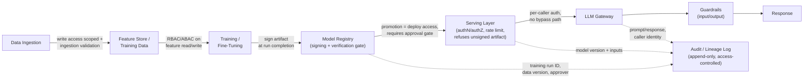

# 3. MLOps/LLMOps Security

**Builds on [2. Cloud Security](../02_cloud_security/tutorial.md).** That tutorial covers
general cloud infrastructure: VPCs, IAM roles, secrets, container hardening — the ground
any workload sits on. This tutorial is about securing the **ML/LLM pipeline itself as a
distinct system**, with its own identities, artifacts, and trust boundaries layered on top
of that infrastructure: a feature store, a model registry, a training job, a serving
endpoint, an LLM gateway. It's also distinct from
[1. LLM Security](../01_llm_security/tutorial.md), which is about the *model's behavior* as
an attack surface (prompt injection, jailbreaks, unsafe outputs) — this tutorial is about
the *pipeline that produces and serves* the model being attackable or misconfigured, which
is a security problem even for a model with no LLM-specific behavior at all. State that
boundary explicitly if asked: cloud security is "is the infrastructure secure," LLM
security is "can the model be manipulated through its inputs/outputs," and this tutorial is
"can the pipeline that builds and serves the model be tampered with or accessed by someone
who shouldn't." [4. Security System Design](../04_security_system_design/tutorial.md)
combines all three into worked case studies.

## Core Concepts

### Feature Store & Model Registry Access Control

Writing a new feature definition or promoting a model version to production are
**privileged actions** — a promoted model version starts serving live traffic and making
real decisions, which makes "who can promote" functionally equivalent to "who can deploy
to production." Apply the same
[RBAC/ABAC](../00_foundations/tutorial.md#iam-authentication-vs-authorization-and-the-protocols-that-implement-them)
reasoning from Foundations here: RBAC for a coarse split (data scientists can write
feature definitions and register model candidates; only an ML-platform role can promote to
production), ABAC when promotion policy needs to depend on attributes of the model or
request itself (a model touching a PII-derived feature needs an additional
compliance-sign-off attribute-check beyond ordinary promotion).

The risk worth naming explicitly: a registry with write access is **equivalent to
production deploy access**, but in practice it's often governed with far looser review
than an actual code change — a code change goes through a PR, CI, and at least one
reviewer; a model promotion click in a registry UI can bypass all three if the registry's
access control isn't deliberately wired into the same gate. The fix isn't a separate
security control bolted onto the registry — it's treating "who can promote" with the exact
rigor a deploy pipeline already has: a required approval step, logged, before a promotion
takes effect.

### Training Data Integrity

[1. LLM Security](../01_llm_security/tutorial.md) covers data/model poisoning from the
*model-behavior* angle — what a poisoned example does to the trained model's outputs. This
tutorial covers the same risk from the **pipeline-security** angle, which is a distinct and
prior question: **who can write to a training data source at all, and does anything
validate or audit a new record before it becomes eligible for training?**

- **Write access to a training data source** should be scoped exactly like any other
  privileged write path — not "anyone with warehouse access can write to this table,"
  but an explicit, auditable set of identities/pipelines permitted to contribute data that
  will eventually train a production model.
- **Ingestion validation** — schema checks, statistical outlier detection, and (where
  feasible) provenance checks on new data before it's marked eligible for a training run,
  rather than trusting every record that lands in the table equally regardless of source.
- **The pipeline needs the same integrity controls as a code deployment pipeline** — a
  code change goes through review, CI, and a merge gate before it reaches production; a
  data pipeline that lets any writer contribute training data with no equivalent gate is
  granting that writer the same influence over production behavior as a code change,
  without any of the same scrutiny. Naming this equivalence directly — "an unreviewed data
  write is an unreviewed code change, just slower to notice" — is the sharp way to make
  this case to a team that already takes code review seriously but hasn't extended that
  instinct to data.

### Model Artifact Signing & Provenance

A trained model checkpoint or fine-tuned adapter is a build artifact, and it deserves the
exact same treatment as a signed container image from
[Cloud Security](../02_cloud_security/tutorial.md#supply-chain-artifact-security): the
same [digital-signature mechanism](../00_foundations/tutorial.md#crypto-essentials-what-you-actually-need-to-reason-about)
from Foundations, applied to a model file instead of a container layer.

- **Sign the artifact at the end of a trusted training run** — after training completes
  and the artifact passes its evaluation gate, the training pipeline (not a human, not a
  step that can be skipped by hand) signs the resulting checkpoint/adapter.
- **A verifiable chain from training run to artifact to deployment** — the signature, plus
  recorded metadata (training run ID, data version, code version), lets anyone ask "prove
  this artifact came from a run that used this exact code and this exact data" and get a
  checkable answer, not an assertion.
- **The serving layer verifies the signature before loading** — refusing to load an
  unsigned or tampered artifact, exactly mirroring the deploy-time verification gap named
  in Cloud Security: a signature that's generated but never checked downstream is
  equivalent to no signature existing at all. This is the concrete mechanism that answers
  "how do you know this model wasn't tampered with after training" — not a policy
  statement, a load-time check that fails closed.

### Serving-Layer Security

An inference endpoint is an API, and needs the same authentication/authorization,
rate-limiting discipline as any other production API — but it also has two attacks that
are specific to querying a model rather than a generic service:

- **Model extraction** — an attacker systematically queries a model API (varying inputs,
  observing outputs) to reconstruct a functionally equivalent copy of the model, stealing
  the IP the model represents without ever accessing the weights directly. This is a
  volumetric, pattern-based attack: a single query reveals nothing, but a large, carefully
  designed query set can reveal enough of the model's decision boundary to train a
  near-equivalent substitute. Mitigations are the same shape as rate-limiting for abuse in
  general, tuned for this specific pattern: per-caller query-volume limits, watching for
  query distributions that look like systematic probing (unusually broad input-space
  coverage rather than the shape of genuine usage) rather than just raw request count, and
  output rate-limiting on high-precision outputs (raw logits/probabilities) that make
  extraction meaningfully easier than top-1 predictions alone.
- **Model inversion** — reconstructing characteristics of the *training data* from the
  model's outputs or, in a white-box setting, its gradients — a privacy risk distinct from
  but related to the training-data-extraction risk covered in
  [LLM Security](../01_llm_security/tutorial.md#core-concepts) (which is specifically about
  an LLM regurgitating memorized training text verbatim). Model inversion is broader:
  even a classical, non-generative model can leak statistical properties of individuals in
  its training set through carefully chosen queries against its outputs.

Both connect forward to the worked incident in
[`05_scenarios/07_model_extraction_via_public_api.md`](../05_scenarios/07_model_extraction_via_public_api.md),
which walks a real extraction attempt end-to-end.

### LLM Gateway Security Specifically

The [LLM gateway](../../system_design_foundation/11_llmops/tutorial.md#llm-gateway-routing-fallback-and-cost-control)
from the LLMOps tutorial centralizes routing, fallback, and cost control; it's also the
single natural place to centralize the security responsibilities that would otherwise be
duplicated (or forgotten) in every service that calls a model:

- **Per-caller authentication and rate limits** — every caller (a service, a team, an
  end-user-facing feature) authenticates to the gateway with its own identity, not a
  shared blanket credential, so a rate limit and an audit trail can both be scoped per
  caller rather than to "traffic to the LLM" undifferentiated.
- **Prompt/response logging for audit** — every request and response passing through the
  gateway is the natural place to log for later audit (see lineage, next section) and for
  guardrail-trigger monitoring, since it's the one point every call is guaranteed to pass
  through.
- **Centralized guardrail enforcement** — the gateway is where input/output guardrails
  from the [LLMOps tutorial](../../system_design_foundation/11_llmops/tutorial.md#guardrails-safety)
  actually get enforced, on the condition that **no direct-to-provider path bypasses it** —
  if any service holds its own provider API key and calls the model directly, that call
  gets none of the gateway's auth, logging, or guardrail enforcement, silently, and the
  gateway's security value is only as strong as the enforcement of "the gateway is the
  *only* path," not just "the gateway is *a* path."

### Audit & Lineage for Compliance

Being able to answer, after the fact, **"which model version, trained on which data,
served this specific prediction"** is a compliance requirement, not just an operational
nicety — it's the direct application of
[non-repudiation](../00_foundations/tutorial.md#the-cia-triad-and-the-vocabulary-built-on-it)
from Foundations to the ML pipeline specifically: an action (a prediction that affected a
real decision) needs to be conclusively attributable after the fact, not reconstructed
from best-effort logs and tribal memory.

[system_design's Reconstructing Model Lineage for an Audit](../../system_design_foundation/12_tricky_scenarios/10_audit_lineage_reconstruction.md)
is a worked example of exactly this problem from the *operations* angle — what breaks when
serving logs don't capture exact model version, registry retention prunes old lineage, or
promotion approval was never a structured record. This tutorial adds the **access-control**
angle on top of that same chain: each link in the lineage chain (serving log, registry
entry, promotion approval, training-data version) is only trustworthy as an audit record
if writes to it were themselves access-controlled and can't have been altered
retroactively — an append-only, access-controlled promotion-approval record answers "who
approved this" reliably; a promotion approval recorded in a channel anyone with write
access could edit after the fact doesn't, regardless of whether the *entry itself* looks
complete.

## Reference Architecture

The ML/LLM pipeline as a chain of trust boundaries, each with its own access-control or
integrity check:

Each arrow is annotated with what's actually enforced at that boundary, not just what
component sits there: ingestion enforces *who can write and whether it's validated before
being training-eligible*; the registry enforces *both* access control on promotion *and*
a signature-verification gate that refuses to register (and the serving layer refuses to
load) an unsigned or tampered artifact; the gateway enforces that *every* call — not just
some — goes through per-caller auth and guardrails. The audit log at the bottom isn't a
side effect of the pipeline running — it's fed deliberately from every boundary above it,
which is what makes lineage reconstruction later a query instead of an investigation.

## Deep-Dive: Verifying Model Provenance End to End

The exercise: prove that the exact model artifact currently running in production came
from a specific training run, on a specific (unpoisoned, access-controlled) dataset,
approved by a specific person — and name what gap remains if any single step below was
skipped.

1. **Data version is pinned and access-controlled at ingestion.** The training run
   references an immutable data version (not "the table as of some approximate time") —
   without this, "what data trained this" can't be answered even if every later step is
   perfect, because the referenced data may no longer correspond to any retrievable actual
   state.
2. **The training run itself is logged with its exact inputs**: data version, code
   version/commit, hyperparameters, and the identity that triggered it. Skipping this
   means the artifact exists but nothing ties it back to a *specific, reproducible* run —
   you'd have a model, not a provenance record.
3. **The resulting artifact is signed immediately at run completion**, before it's
   eligible for registration — signing something *after* it's already been sitting
   unregistered and unverified for a while reopens a window where it could have been
   swapped or modified between training and signing.
4. **The registry records the full chain** (artifact signature, training run ID, data
   version, evaluation results) and **enforces that a promotion requires an explicit,
   logged approval** — skipping the approval-gate step means the artifact's technical
   provenance is solid, but "who approved this for production" — the human-accountability
   half of the chain — has no answer.
5. **The serving layer verifies the signature before loading the artifact**, refusing to
   serve anything that doesn't verify — skip this step and every prior step is
   theater: a perfectly signed, perfectly logged artifact provides zero protection if the
   thing actually running in production was never checked against that signature.
6. **Serving logs capture the exact model version per prediction**, not just "the current
   endpoint" — skip this and steps 1-5 can be flawless, yet a specific historical
   prediction still can't be tied back to a specific model version, because the join point
   between "a prediction happened" and "which version served it" was never recorded.

The reusable takeaway: **provenance is a chain, and it's only as strong as its weakest
verified link** — a team that signs artifacts but doesn't check signatures at load time,
or logs training runs but not per-prediction model version, has each individual control
"done" while the actual end-to-end question — prove this prediction came from this
exact, unpoisoned, approved artifact — remains unanswerable. This is the same
chain-of-links reasoning as the lineage-reconstruction scenario referenced above, applied
proactively (designing the chain) rather than reactively (auditing which link broke after
the fact).

## Trade-offs

| Decision | Option A | Option B | When to pick which |
|---|---|---|---|
| Registry access control | Anyone with warehouse/platform access can promote | Promotion requires a distinct, logged approval role | Distinct approval role always for anything reaching production — a registry with promote access equivalent to unreviewed prod deploy is the gap this tutorial names as its core risk |
| Training data write access | Open write access to the training data source | Scoped, audited write access with ingestion validation | Scoped access once the data source feeds a production model at all — "just a data table" and "an input to production decisions" are the same thing once training happens on it |
| Model signing enforcement | Sign artifacts, but don't gate loading on verification | Sign and enforce verification at load time (fail closed) | Fail-closed verification always — an unenforced signature provides the appearance of integrity control with none of the actual protection |
| LLM access pattern | Services call the provider API directly, gateway optional | All calls forced through a single gateway | Forced-through-gateway once more than one service calls a model — a single un-enforced bypass path makes every gateway-level guardrail and audit log incomplete, not just weaker |
| Extraction defense | Rely on generic API rate limits only | Query-pattern monitoring specific to extraction (input-space coverage, high-precision output limiting) | Generic rate limits catch volumetric abuse; pattern-specific monitoring is needed once the model itself represents meaningful IP worth a dedicated extraction attempt |

## Failure Modes to Raise Proactively

- **A registry with promote-to-production access equivalent to deploy access, but no
  approval gate** — the single highest-leverage gap in this tutorial: a model promotion
  gets far less scrutiny than a code change with the same blast radius, purely because it
  happens in a different tool than the one everyone already takes seriously.
- **Signed artifacts, unverified at load** — the exact failure mode Foundations names
  generically ("a signature that exists on paper but isn't checked downstream"),
  concretely instantiated for model artifacts: signing is implemented in CI, but the
  serving layer loads whatever's in the registry without checking the signature at all.
- **A direct-to-provider bypass path around the LLM gateway** — one service holds its own
  API key "temporarily" and never migrates to the gateway, silently exempting all of its
  traffic from every guardrail, rate limit, and audit log the gateway was built to provide
  for everyone else.
- **Training data treated as lower-stakes than code**, with open write access and no
  ingestion validation, even though a poisoned or low-quality write has the same influence
  on production behavior as an unreviewed code change — just discovered later and harder
  to trace back to its source.
- **Lineage exists per-component but doesn't chain** — the registry has good lineage, the
  serving logs have good lineage, but there's no shared identifier (a model-version ID
  logged consistently everywhere) linking them, so reconstructing an answer requires manual
  correlation across systems instead of a single query.

## Make It Yours

- In a platform you've worked on, who could promote a model to production — and was that
  access reviewed with the same rigor as who can merge to your main branch?
- Does your training data pipeline validate or audit new writes before they're eligible
  for training, or is "anyone with warehouse access" effectively "anyone who can influence
  a future production model"?
- If asked today to prove which exact model version served a specific prediction from
  three months ago, which link in the chain (data version, training run record, registry
  lineage, per-prediction serving log) would actually fail first?

## Practice Questions

- Design the access-control model for a shared model registry used by five ML teams —
  who can register a candidate, who can promote to production, and how do you keep
  promotion from becoming a rubber stamp under deadline pressure?
- A production incident reveals a model artifact running in serving doesn't match any
  signed artifact in the registry — walk through how you'd determine whether this is a
  tampering incident or a broken deploy pipeline, and what you'd check first.
- Design defenses against model extraction for a public-facing inference API that must
  remain usable for legitimate high-volume customers — where's the line between a
  legitimate power user and a systematic extraction attempt, and how would you draw it
  operationally rather than just conceptually?

## Articulate It: Interview Framing & Vocabulary

### Three Ways to Explain This

- **Equivalence framing (the default for the registry/access-control discussion):** "A
  model registry with promote access is functionally a production-deploy mechanism, and I'd
  argue it needs the exact rigor a deploy pipeline already has — a required approval gate,
  logged — because in practice it's often governed far more loosely than a code change with
  the same blast radius, purely because it lives in a different tool."
- **Chain-is-only-as-strong-as-its-weakest-link framing (good for the provenance
  deep-dive):** "Provenance isn't one control, it's a chain — pinned data version, signed
  artifact, enforced verification at load, per-prediction version logging. Any one link
  skipped makes the whole chain unable to answer the actual question, even if every other
  link is done perfectly."
- **Boundary-naming framing (good for distinguishing this tutorial from the other two):**
  "Cloud security asks if the infrastructure is secure; LLM security asks if the model can
  be manipulated through its inputs and outputs; this is about whether the pipeline that
  builds and serves the model can itself be tampered with or accessed by someone who
  shouldn't be able to — three different trust boundaries, easy to conflate if you don't
  name them separately."

### Vocabulary Builder

**Technical shorthand — use these instead of over-explaining the concept every time:**

- **model extraction** (n. phrase) — systematically querying a model API to reconstruct a
  functionally equivalent copy, stealing IP without ever accessing the weights.
- **model inversion** (n. phrase) — reconstructing characteristics of training data from a
  model's outputs or gradients; a privacy risk distinct from verbatim training-data
  extraction.
- **fail closed** (adj. phrase) — a control that blocks the action by default when
  verification can't succeed (an unsigned artifact refuses to load) rather than defaulting
  to permit.
- **provenance chain** (n. phrase) — the linked, verifiable record from a specific training
  run through to a specific deployed artifact, each link independently checkable.
- **bypass path** (n. phrase) — any route that reaches a protected resource without
  passing through the control meant to guard it (a service calling a model provider
  directly instead of through the gateway).

**Expressive phrases — for stating a trade-off fluently instead of listing pros/cons:**

- **"…equivalent to production deploy access, governed with far less rigor"** — a precise
  way to argue that a registry's informal promotion process is a security gap, not just an
  operational inconvenience.
- **"…theater if the check never actually runs downstream"** — a blunt way to describe a
  signing or logging control that exists on paper but changes nothing in practice.
- **"…only as strong as its weakest verified link"** — a fluent, reusable frame for any
  chain-of-custody or provenance argument, not just this one.
- **"…discovered later and harder to trace back to its source"** — useful phrasing for why
  treating data writes as lower-stakes than code changes is a false economy.
- **"…a single un-enforced bypass makes every downstream control incomplete, not just
  weaker"** — precise language for explaining why centralized enforcement (a gateway, a
  single write path) fails all-or-nothing rather than gracefully.

---

**Previous:** [2. Cloud Security](../02_cloud_security/tutorial.md)  |  **Next:** [4. Security System Design](../04_security_system_design/tutorial.md)
