# Case Study: Secure Multi-Tenant ML Platform

Applies the framework from [4. Security System Design](tutorial.md): clarify → threat model
→ high-level design with trust boundaries → deep-dive on the highest-risk boundary →
trade-offs → staff-altitude note.

## The Scenario

Design an internal ML platform shared by multiple teams (tenants) — e.g. a Fraud team, a
Recommendations team, and a Search-Ranking team — to train models and register them for
serving. All tenants share the same underlying compute cluster for cost efficiency. The
hard requirement: **one tenant must never be able to read another tenant's training data,
model artifacts, or serving traffic**, even though the infrastructure underneath all of them
is the same physical/virtual cluster.

## Clarifying Questions

- **Trust model of the caller** — every caller is an authenticated engineer or an
  authenticated service account belonging to one specific tenant team; there is no anonymous
  access. The interesting question isn't authentication, it's whether the platform's
  authorization model actually maps every action back to a specific tenant, consistently,
  everywhere.
- **What does "shared infrastructure" actually mean here?** — confirm: shared physical/VM
  compute cluster (e.g. one Kubernetes cluster), shared feature store, shared model
  registry, shared serving infrastructure — or are any of these already tenant-dedicated?
  Assume, for this design, everything is genuinely shared at the infrastructure layer, which
  is the harder and more realistic version of the problem.
- **Is cross-tenant sharing ever a legitimate requirement?** — e.g. does the Fraud team ever
  need a feature the Recommendations team owns? Assume yes, occasionally, via an explicit,
  audited grant — not assuming a purely hermetic model, since real ML platforms usually do
  have legitimate cross-team feature reuse, and the design has to support explicit sharing
  without that becoming a backdoor around isolation by default.
- **What's the compliance angle, if any?** — assume at least one tenant (Fraud) handles data
  subject to stricter regulatory retention/access requirements than the others, meaning
  the isolation guarantee has to be provably auditable, not just true in practice.
- **Threat actor capability** — assume the realistic threat is a misconfiguration (a
  namespace boundary or IAM policy that's broader than intended) or a compromised
  low-privilege credential within one tenant, not a sophisticated attacker who has already
  achieved node-level compute compromise. That said, the design should still bound the
  damage of a full compute-node compromise as a defense-in-depth backstop, even though it's
  not the primary threat being designed against.

## Threat Model (STRIDE)

| STRIDE Category | Concrete Threat in This System | Mitigation |
|---|---|---|
| **Spoofing** | A service account or pod belonging to Tenant A's training job presents itself (intentionally or via misconfiguration) as belonging to Tenant B, gaining Tenant B's permissions | Workload identity bound to namespace, not to a portable credential — each tenant's compute runs under its own service account, verified via the cluster's identity mechanism, not a shared static credential |
| **Tampering** | A model artifact registered by Tenant A's pipeline is overwritten or altered by a job running under Tenant B's namespace | Model registry write access scoped per tenant namespace; artifacts signed at registration per [03_mlops_llmops_security](../03_mlops_llmops_security/tutorial.md), so even a successful write is detectable as unauthorized at consumption time |
| **Repudiation** | A tenant's training data or model is accessed and there's no record of which tenant/identity did it | Every feature-store read, registry read/write, and serving-config change logged with the requesting tenant's identity, feeding a per-tenant audit trail |
| **Information Disclosure** | Tenant B reads Tenant A's training data from the feature store, or Tenant A's model weights from the registry, or observes Tenant A's live serving traffic (e.g. via a shared inference endpoint or shared node's network path) | **Tenant isolation at the compute layer** — the single highest-risk boundary in this system; see the Deep-Dive below |
| **Denial of Service** | Tenant B's training job consumes all shared cluster resources (CPU/GPU/memory), starving Tenant A's training or serving workloads | Per-tenant resource quotas enforced at the cluster/namespace level, independent of the isolation controls that protect confidentiality |
| **Elevation of Privilege** | Tenant B's engineer, with legitimate access to their own namespace, exploits a shared-cluster misconfiguration (an overly broad RBAC `ClusterRole`, or a network policy gap) to reach Tenant A's pods, secrets, or storage | Namespace-scoped RBAC (`Role`/`RoleBinding`, never a `ClusterRole` granting cross-namespace access by default) plus default-deny network policies between namespaces, explicitly allow-listed only for the legitimate cross-team sharing case named in clarifying questions |

## High-Level Design

```mermaid
flowchart TB
    EngA(("Tenant A\nEngineer/Service")) -.->|"boundary 1: authN\n(workload identity)"| NSAd
    EngB(("Tenant B\nEngineer/Service")) -.->|"boundary 1: authN\n(workload identity)"| NSBd

    subgraph Cluster["Shared Compute Cluster"]
        subgraph NSA["Tenant A Namespace"]
            NSAd["Training Jobs"]
        end
        subgraph NSB["Tenant B Namespace"]
            NSBd["Training Jobs"]
        end
        NSA -.->|"boundary 2: NETWORK POLICY\n+ NAMESPACE RBAC\n(default deny) — HIGHEST RISK"| NSB
    end

    NSA -->|"boundary 3: scoped\nread/write"| FSA["Feature Store\n(Tenant A partition)"]
    NSB -->|"boundary 3: scoped\nread/write"| FSB["Feature Store\n(Tenant B partition)"]

    NSA -->|"boundary 4: scoped\nregistry write"| RegA["Model Registry\n(Tenant A namespace,\nsigned artifacts)"]
    NSB -->|"boundary 4: scoped\nregistry write"| RegB["Model Registry\n(Tenant B namespace,\nsigned artifacts)"]

    RegA --> ServeA["Serving\n(Tenant A endpoint,\nisolated traffic path)"]
    RegB --> ServeB["Serving\n(Tenant B endpoint,\nisolated traffic path)"]

    NSA --> Secrets["Secrets Manager\n(per-tenant scoped\ncredentials, short-lived)"]
    NSB --> Secrets

    NSA --> Audit["Audit Log\n(per-tenant identity\non every access)"]
    NSB --> Audit

    style NSA fill:#3a1414,stroke:#a33
    style NSB fill:#3a1414,stroke:#a33
```

Trust boundaries, in order of where the design puts the most scrutiny:

- **Boundary 1** — engineer/service to cluster: workload identity via the cluster's native
  mechanism, scoped to a namespace, never a shared static credential usable across
  namespaces.
- **Boundary 2 — compute-layer tenant isolation — the boundary this design spends the most
  time on.** See Deep-Dive below.
- **Boundary 3** — namespace to feature store: per-tenant partition with scoped read/write
  credentials, following the ABAC-style "your own data only" pattern from
  [00_foundations](../00_foundations/tutorial.md#the-cia-triad-and-the-vocabulary-built-on-it).
- **Boundary 4** — namespace to model registry: scoped write access plus signed artifacts,
  per [03_mlops_llmops_security](../03_mlops_llmops_security/tutorial.md), so tampering is
  detectable even if a write-scope gap is ever exploited.

## Deep-Dive: Tenant Isolation at the Compute Layer

**This is the single highest-risk boundary in the system, and the one this design commits
its deep-dive time to** — using the same ranking discipline from
[the framework tutorial](tutorial.md#deep-dive-choosing-where-to-spend-your-limited-interview-time).

Ranking the candidates in this system:

| Candidate boundary | Blast radius if it fails |
|---|---|
| Feature store partitioning (boundary 3) | Serious, but scoped to training data specifically, and typically caught by data-access audit review |
| Model registry write access (boundary 4) | Serious, but artifact signing bounds the damage — a tampered artifact is detectable before it's ever deployed to serving |
| Secrets management | Serious if a credential leaks, but short-lived, per-tenant-scoped credentials bound the exposure window |
| **Compute-layer tenant isolation (boundary 2)** | **Unbounded** — a gap here (a missing network policy, an overly broad RBAC role) doesn't just leak one dataset; it potentially exposes *everything* the compromised namespace can reach: training data, mounted secrets, in-memory model state, and observable network traffic to other tenants' pods on the same nodes |

Compute-layer isolation wins the ranking for a reason specific to shared infrastructure:
**it's the boundary most likely to be assumed secure by default, and isn't.** Feature-store
partitioning and registry access control are conventional access-control problems that most
engineers instinctively scope correctly — you wouldn't ship a feature store without
per-tenant read scoping, because the schema itself makes the tenant boundary visible. A
shared Kubernetes cluster, by contrast, is secure-by-default in exactly zero dimensions that
matter here: namespaces alone provide organizational grouping, not network isolation or
RBAC isolation, unless both are configured explicitly. Assuming "it's in a different
namespace" is equivalent to the "it's inside our VPC, it must be safe" fallacy from
[00_foundations](../00_foundations/tutorial.md#threat-modeling-stride-and-trust-boundaries)
— a namespace is an organizational label, not a trust boundary, until network policy and
RBAC make it one.

**The mechanism, concretely:**

- **Namespace-per-tenant is necessary but not sufficient.** A Kubernetes namespace by itself
  imposes no network isolation between pods in different namespaces — by default, any pod
  can reach any other pod's IP across the entire cluster, namespace boundaries
  notwithstanding. This is the single most common gap in a real deployment: a team stands up
  "isolated" namespaces and stops there, leaving pod-to-pod traffic entirely open — the exact
  container/Kubernetes-security gap covered generically in
  [02_cloud_security](../02_cloud_security/tutorial.md#container-kubernetes-security).
- **Default-deny network policies, explicit allow-list for legitimate sharing.** The
  network-policy default must be deny-all cross-namespace traffic, with narrow, explicit
  allow rules only for the specific legitimate cross-tenant case named in clarifying
  questions (e.g. Fraud reading one specific Recommendations feature) — never a blanket
  "allow within the cluster" rule; this is the same VPC/subnet-level segmentation principle
  from [02_cloud_security](../02_cloud_security/tutorial.md#network-segmentation-vpc-design),
  applied inside a single cluster instead of across a cloud network.
- **RBAC scoped to `Role`/`RoleBinding` within a namespace, never `ClusterRole` for
  tenant-facing permissions.** A `ClusterRole` grants a permission cluster-wide by
  definition; using one for a tenant's day-to-day permissions (even unintentionally, via a
  copy-pasted manifest) silently grants cross-tenant access that RBAC review may not catch
  if reviewers are looking at the permission verb, not its cluster-vs-namespace scope.
- **Secrets are namespace-scoped and short-lived**, following the KMS-boundary discipline
  from [00_foundations](../00_foundations/tutorial.md#failure-modes-to-raise-proactively)
  and the secrets-management practice from
  [02_cloud_security](../02_cloud_security/tutorial.md#secrets-management): a tenant's
  service account requests credentials from a secrets manager scoped to that tenant's
  namespace, never a long-lived, broadly-scoped static secret mounted across tenants.
- **Node-level compromise as the defense-in-depth backstop, not the primary defense.**
  Even with network policy and RBAC correctly enforced, a full node compromise (an attacker
  who escapes a container) can potentially observe co-located tenants' workloads at the
  kernel/hypervisor level. The backstop here — not the primary control, since it's a much
  higher bar for an attacker to clear — is scheduling the most sensitive tenant's workloads
  on dedicated node pools rather than trusting namespace-level controls alone against that
  specific, more capable threat.

## Trade-offs

| Decision | Option A | Option B | When to pick which |
|---|---|---|---|
| Compute isolation strength | Shared cluster, namespace + network policy + RBAC isolation | Fully dedicated cluster per tenant | Shared cluster is the cost-efficient default and is sufficient against the stated threat model (misconfiguration, compromised low-privilege credential); dedicated clusters when a tenant's compliance requirement explicitly mandates physical/logical separation, or the threat model includes a more capable attacker who might achieve node-level compromise |
| Cross-tenant feature sharing | No sharing — fully hermetic per-tenant silos | Explicit, audited, narrowly-scoped grants for named legitimate cases | Hermetic silos are simpler to reason about and audit but block real, legitimate reuse that most ML orgs actually need; explicit grants support real workflows at the cost of a slightly larger attack surface that has to be actively governed, not just configured once |
| RBAC granularity | Coarse, small number of roles per tenant | Fine-grained roles per action (train vs. deploy vs. read-registry) | Coarse roles are easier to audit at a glance but can't express "this service account can train but not deploy to serving" without over-granting; fine-grained roles are the correct default once training and serving are operated by different sub-teams or pipelines within a tenant |
| Node scheduling | All tenants freely co-scheduled across all nodes | Dedicated node pools for the highest-sensitivity tenant | Free co-scheduling is more resource-efficient; dedicated pools are worth the cost specifically for a tenant whose compliance posture assumes a stronger isolation guarantee than namespace-level controls alone provide |

## Staff-Altitude Notes

A **senior** answer designs namespace-per-tenant isolation, scopes the feature store and
model registry per tenant, and can explain RBAC and network policy correctly when asked.

A **staff** answer additionally: (1) names, unprompted, that a namespace alone is an
organizational label, not a security boundary, and explicitly states which two mechanisms
(network policy, RBAC scope) are what actually make it one — this is the specific insight
that separates "I used namespaces" from "I understand why namespaces alone don't isolate
anything"; (2) reasons about organizational blast radius, not just technical blast radius —
a compute-isolation gap here isn't just a technical bug, it potentially exposes a
regulated tenant's data to every other team sharing the cluster, which changes who has to
be looped in on the design (the compliance/security org, not just the platform team) and
what the incident-response runbook needs to assume is possible; (3) names the cost of the
stronger control explicitly — dedicated node pools or dedicated clusters are a real
infrastructure cost and operational overhead (separate upgrade cadences, separate capacity
planning), and a staff answer states it's worth paying *specifically* for the tenant whose
compliance posture demands it, rather than either applying it uniformly (wasteful) or never
considering it (under-protective for that one tenant); and (4) explicitly states what's out
of scope given the assumed threat model — "I'm designing against misconfiguration and a
compromised low-privilege credential; I'm treating full node/hypervisor compromise as a
defense-in-depth backstop via dedicated node pools for the most sensitive tenant, not as the
primary threat this design optimizes against, and I'd confirm that's the right line before
investing further in kernel-level isolation."

## Articulate It: Interview Framing & Vocabulary

### Three Ways to Explain This

- **Label-versus-boundary framing (the default for explaining why compute isolation is the
  deep-dive target):** "A namespace is an organizational label, not a security boundary,
  until network policy and RBAC scope make it one — and that gap is exactly why this
  boundary is the one most likely to be assumed secure by default when it isn't, which is
  why it gets the deep-dive over the feature store or registry, both of which engineers
  instinctively scope correctly."
- **Necessary-but-not-sufficient framing (good for explaining the isolation mechanism
  itself):** "Namespace-per-tenant is necessary but not sufficient — by default any pod can
  reach any other pod across the whole cluster regardless of namespace, so the actual
  controls doing the work are default-deny network policy and namespace-scoped RBAC, not the
  namespace boundary itself."
- **Backstop framing (good for the node-compromise discussion):** "I'm not designing
  primarily against full node compromise — that's a higher bar than the stated threat model
  — but I'd still schedule the most sensitive tenant on dedicated node pools as a
  defense-in-depth backstop, since namespace-level controls alone don't survive that
  specific, more capable threat."

### Vocabulary Builder

- **namespace isolation** (n. phrase) — the (insufficient, by itself) organizational
  grouping a cluster orchestrator provides; requires network policy and RBAC scoping to
  become an actual trust boundary.
- **default-deny** (adj. phrase) — a network or access policy that blocks all traffic/access
  except what's explicitly allow-listed; the correct default posture between tenants sharing
  infrastructure.
- **`ClusterRole` vs. `Role`** (n. phrase) — the Kubernetes RBAC distinction between a
  cluster-wide permission grant and a namespace-scoped one; a common, easy-to-miss source of
  accidental cross-tenant privilege.
- **"…assumed secure by default, and isn't"** — a precise way to argue why a boundary
  deserves deep-dive attention even when it's less technically novel than others in the
  system.
- **blast radius** (n. phrase) — here specifically: everything a compromised namespace's
  identity can reach if compute-layer isolation fails, which is why this boundary ranks
  above feature-store or registry access scoping.

---

**Previous:** [Case Study: Secure RAG Pipeline](design_secure_rag_pipeline.md)  |  **Next:** [Security Incident Scenarios](../05_scenarios/README.md)
