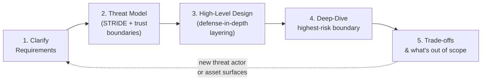

# 4. Security System Design

This tutorial gives you a repeatable structure for any "design a secure X" interview
question. It builds directly on two things covered earlier in this track: the **STRIDE**
threat-modeling method and **trust boundary** concept from
[00_foundations](../00_foundations/tutorial.md#threat-modeling-stride-and-trust-boundaries),
and the four-step system-design structure (clarify → high-level design → deep-dive →
trade-offs) used throughout [system_design_practice](../../system_design_foundation/prerequisite_concepts/00_staff_level_signal.md).
The two case studies that follow —
[Secure RAG Pipeline](design_secure_rag_pipeline.md) and
[Secure Multi-Tenant ML Platform](design_secure_multi_tenant_ml_platform.md) — are worked
applications of the framework built here; read this one first.

## Core Concepts

### The Four-Step Structure, Security-Adapted

A general system-design round runs clarify → high-level design → deep-dive → trade-offs,
and high-level design comes right after clarifying because the interviewer usually wants to
see you can hold the whole system in your head before you zoom in anywhere. A
security-focused round needs one structural change: **threat-modeling has to happen right
after clarifying and before you draw a single component.**

The reason isn't cosmetic. In a general design round, the components largely determine
themselves from the functional requirements — a feed needs storage, a fan-out path, and a
ranking step, more or less regardless of who's attacking it. In a security round, the
*shape* of the high-level design is a direct function of the threat model: whether the
caller is an authenticated employee, an anonymous member of the public, or another service
changes which boxes you draw and where you put the boundaries between them. Sketching boxes
before naming the threat model means you'll likely have to redraw the diagram once you do
name it — a visibly wasted step in a 45-minute room. The adapted structure:

Say this transition out loud — it's a cheap, high-signal sentence: *"Before I sketch
components, I want to threat-model this at a high level, since who's attacking it and what
they're after should drive the shape of the design, not the other way around."*

### Clarifying Questions Specific to Security Rounds

The general framework's clarifying questions (scope, scale, latency, consistency) still
apply, but a security round adds a second set that a senior candidate often skips and a
staff candidate treats as load-bearing:

1. **Trust model of the caller** — is this an authenticated employee, an anonymous public
   user, or another internal service calling on someone's behalf? This single answer
   determines whether authentication is even a relevant boundary to design, or whether it's
   already assumed and the real question is authorization.
2. **Sensitivity of the data involved** — PII, financial data, and public marketing copy
   imply wildly different control budgets for the same architecture; naming the sensitivity
   tier early prevents over- or under-engineering the rest of the answer.
3. **Compliance/regulatory angle** — SOC 2, HIPAA, PCI-DSS, or GDPR-scoped data each impose
   specific, non-negotiable controls (audit retention windows, data residency, encryption
   mandates) that aren't discovered by threat-modeling alone — asking this up front avoids
   designing something technically sound but non-compliant.
4. **Threat actor's assumed capability level** — an opportunistic scanner running automated
   tooling against anything public-facing is a very different adversary than a targeted,
   funded actor who has already done reconnaissance on this specific system. This is the
   single most consequential question in the whole list: it directly determines what you
   should explicitly decline to defend against (see Staff-Altitude below), which is a
   sentence most candidates never say out loud.

### Trust-Boundary-First High-Level Design

Once the threat model is named, draw the high-level design as boxes **and the trust
boundaries between them**, before naming any specific technology. A senior answer names the
boxes: "there's a gateway, a service layer, a database." A staff answer additionally names,
*before being asked*, which boundary is the actual highest-risk one and why — e.g. "the
boundary I'm most worried about here isn't the public edge, which is well-trodden ground
with mature tooling; it's the internal boundary between the retrieval layer and the
document store, because that's where an authorization check is easy to accidentally scope
too broadly and no WAF or edge control will catch that mistake."

Naming technology (Envoy, Istio, a specific IAM product) before the trust boundaries are
drawn is a common tell that a candidate is pattern-matching to a familiar stack rather than
reasoning from the actual system in front of them.

### Defense-in-Depth Layering as a Design Habit

This is the same two-part frame from
[00_foundations](../00_foundations/tutorial.md#threat-modeling-stride-and-trust-boundaries):
for any single control you name, immediately name the second layer — what happens if the
first one fails. "I'd put an authorization check at the API gateway" is an incomplete
sentence in a security round; "I'd put an authorization check at the API gateway, and *also*
re-check it at the data-access layer itself, so a gateway misconfiguration doesn't silently
become a full bypass" is the complete one. Practicing this as a verbal habit — never
stating a control without its failure-mode partner — is most of what "sounds staff" in this
specific round.

### Staff-Altitude Framing for Security Rounds

A senior answer in a security round threat-models correctly, draws a reasonable
defense-in-depth architecture, and can defend each control when pushed. A staff answer adds
three things on top, unprompted:

- **Organizational blast radius, not just system blast radius.** A senior answer says "if
  this service account leaks, an attacker gets read access to this database." A staff
  answer adds: "...which also means the on-call team for three downstream services now has
  to be looped into the incident response, since they consume data derived from this same
  store" — the same technical fact, extended to who else it touches.
- **Naming the cost/friction of a control, not just its security benefit.** "mTLS
  everywhere" sounds unambiguously good at senior altitude. At staff altitude: "mTLS
  everywhere is the textbook answer, but it has a real operational cost — certificate
  rotation infrastructure, debugging latency added to every hop, and an onboarding tax for
  every new service. I'd scope it to boundaries crossing into the sensitive data tier first,
  and extend it opportunistically, rather than mandate it uniformly on day one."
- **Explicitly naming what you would NOT defend against.** Given a stated threat model (say,
  "assume an opportunistic attacker, not a nation-state"), a staff answer says so out loud:
  "given that threat model, I'm not going to design against a supply-chain attack on our
  compiler toolchain — that's a real risk in the abstract, but it's disproportionate to the
  stated actor, and defending everything uniformly is itself a signal of not having
  prioritized." This is the single highest-leverage sentence in the whole framework, and the
  one senior answers almost never say — defending against everything equally is not
  thoroughness, it's an absence of judgment.

## Reference Architecture

A generic secure-system template, reusable as a mental starting point for any case study —
annotated with where each STRIDE category most naturally applies:

```mermaid
flowchart TB
    Client(("Client /\nCaller")) -.->|"boundary 1: untrusted edge\n(S,D)"| Edge
    subgraph Edge["Edge Layer"]
        WAF["WAF / Rate Limiter"]
    end
    Edge -->|"boundary 2: authN/authZ\n(S,E)"| Gateway["AuthN/AuthZ Gateway\n(OIDC + policy check)"]
    Gateway -->|"boundary 3: service mesh\n(S,T)"| Mesh
    subgraph Mesh["Service Mesh (mTLS between services)"]
        SvcA["Service A"]
        SvcB["Service B"]
        SvcA <--> SvcB
    end
    Mesh -->|"boundary 4: data access\n(T,I)"| Data
    subgraph Data["Data Tier"]
        DB[("Database\n(encrypted at rest)")]
        KMS["KMS"]
        DB <--> KMS
    end
    Mesh --> Audit["Audit Log\n(append-only, R)"]
    Gateway --> Audit

    style Edge fill:#3a1414,stroke:#a33
```

- **Boundary 1 (edge)** — Spoofing and Denial of Service dominate: an anonymous caller, rate
  limiting and TLS termination as the first line.
- **Boundary 2 (gateway)** — Spoofing (is this identity real) and Elevation of Privilege (is
  this identity authorized for *this* action) — the point where authN happens and authZ
  must be re-checked per request, never assumed from a prior step.
- **Boundary 3 (mesh)** — Spoofing (service-to-service identity via mTLS) and Tampering
  (unencrypted or unauthenticated inter-service calls).
- **Boundary 4 (data)** — Tampering and Information Disclosure — least-privileged,
  short-lived credentials to the data tier, encryption at rest, and keys that never leave
  the KMS boundary.
- **Audit log, cutting across everything** — Repudiation — every privileged action at every
  boundary should leave a record, independent of which boundary it crossed.

## Deep-Dive: Choosing Where to Spend Your Limited Interview Time

A 45-minute round cannot get a full STRIDE pass and a deep architecture discussion at every
trust boundary in the reference diagram above — there are four boundaries there alone, and
a real system usually has more. The rule for picking which *one* boundary to go deep on:
**pick the boundary with the highest blast radius if it fails, not the boundary that's most
interesting to talk about.** These are not the same boundary as often as candidates assume
— mTLS and service meshes are more fun to discuss than a boring authorization check, which
is exactly why candidates default to the wrong one.

**Worked example.** Take a hypothetical internal analytics dashboard over customer usage
data, with four candidate boundaries:

| Candidate boundary | Why it's tempting to pick | Actual blast radius if it fails |
|---|---|---|
| Public edge (WAF, rate limiting) | Familiar, well-documented, lots to say | Bounded — mature tooling exists, and a failure here is loud (an outage or a blocked-traffic alert), not silent |
| Service mesh mTLS | Technically interesting, "sounds staff" | Bounded — a mesh misconfiguration is usually caught by mesh-level observability, and the blast radius is one hop, not the whole dataset |
| Authorization at the dashboard's data-access layer (can user X see customer Y's data?) | Sounds mundane, easy to under-invest in | **Unbounded** — a single missed per-resource check exposes every customer's data to every dashboard user, silently, with no alert until someone notices in an audit |
| Audit logging pipeline | Easy to gesture at ("we log everything") | Bounded — a logging gap is bad for post-incident forensics but doesn't itself cause a breach |

The authorization boundary wins, not because it's the most technically rich to discuss, but
because its failure mode is silent, total, and hard to detect after the fact — exactly the
profile that should draw deep-dive time. Say the ranking out loud before committing to a
deep-dive target; it's a direct demonstration of the prioritization judgment being tested,
and it's the same reasoning applied concretely in
[the RAG case study's retrieval-time-authorization deep-dive](design_secure_rag_pipeline.md#deep-dive-retrieval-time-authorization)
and
[the multi-tenant platform case study's compute-isolation deep-dive](design_secure_multi_tenant_ml_platform.md).

## Trade-offs

| Decision | Option A | Option B | When to pick which |
|---|---|---|---|
| Threat-model depth vs. time budget | Full STRIDE pass on every component | STRIDE only at trust boundaries touching the highest-sensitivity asset | Full pass only if time genuinely allows (rare in 45 minutes); boundary-focused pass is the practical default — state this choice explicitly rather than silently doing a shallow pass everywhere |
| mTLS scope | mTLS on every service-to-service hop | mTLS selectively on boundaries into the sensitive data tier | Uniform mTLS for a mature platform team with existing cert-rotation tooling; selective mTLS when that tooling doesn't exist yet and the rollout cost would stall the actual priority boundary |
| Control type | Blocking (deny the request) | Detective (log/alert, allow, investigate) | Blocking for well-understood, high-confidence threats (a malformed request); detective for lower-confidence signals where blocking risks false-positive availability loss (e.g. an anomalous-but-plausible access pattern) |
| Where authorization lives | Centralized policy engine (e.g. one OPA/ABAC service all callers go through) | Authorization logic embedded per-service | Centralized when consistency across many services matters more than any single service's latency; embedded when a service's authorization logic is genuinely unique and a shared engine would become a bottleneck or a lowest-common-denominator constraint |
| Compliance scope | Design to the strictest applicable regime globally | Segment data/infra by regulatory boundary (e.g. region-scoped storage) | Global-strictest is simpler to reason about but often over-constrains parts of the system that don't need it; segmentation is more design and ops complexity but avoids paying the strictest tax everywhere |

## Failure Modes to Raise Proactively

- **Naming security *products* instead of the *property* being defended.** "I'd add a WAF"
  and "I'd add a SIEM" are answers about tools, not about what property (confidentiality,
  integrity, availability, non-repudiation) is actually being protected — an interviewer can
  always ask "and what does that actually stop," and a product name alone doesn't answer it.
- **Defending everything with equal weight.** Treating every boundary as equally critical is
  indistinguishable, from the interviewer's seat, from not having prioritized at all — see
  the Deep-Dive above.
- **Never stating a threat model explicitly, and therefore never being able to say what's
  out of scope.** If you can't say "I'm not defending against X given this actor," you
  haven't actually stated a threat model — you've just described generic best practices.
- **Jumping to high-level design before threat-modeling.** The specific failure this
  framework is built to prevent — see "The Four-Step Structure, Security-Adapted" above.
- **Treating authentication and authorization as one step.** Verifying identity once at
  login and never re-checking authorization per resource is the IDOR pattern from
  [00_foundations](../00_foundations/tutorial.md#failure-modes-to-raise-proactively) —
  it reappears in almost every security system-design round in some form.

## Make It Yours

- Pick a system you actually operate or have designed: can you name its trust boundaries in
  order of blast radius, out loud, in under a minute?
- For that same system, what's the one boundary you'd explicitly decline to harden further
  given its actual threat model — and can you defend that choice if pushed?
- Practice saying the defense-in-depth two-part sentence ("I'd add X, and if X fails,
  Y bounds the damage") for every control in that system, not just the ones you're proudest
  of.

## Practice Questions

- Design a secure multi-region payment processing system, where a compromised region must
  not be able to authorize transactions on behalf of another region.
- Design a secure internal developer platform with self-service deploys, where any engineer
  can ship to production without a human in the loop, but a compromised laptop must not be
  able to ship arbitrary code to a customer-facing service unnoticed.
- Design a secure customer-support tool that gives support agents temporary elevated access
  to a customer's account data, where the elevation must be time-bounded, logged, and
  provably tied to an open support ticket.
- Design a secure webhook-delivery system for third-party integrations, where a malicious or
  compromised third party must not be able to use the webhook mechanism to reach internal
  infrastructure (SSRF) or spoof events on behalf of other tenants.

## Articulate It: Interview Framing & Vocabulary

### Three Ways to Explain This

- **Ordering-first framing (the default when asked how a security round differs from a
  general design round):** "The structure is the same four steps, but I move threat-modeling
  ahead of high-level design, not after it — in a security round the threat model determines
  the shape of the components, so drawing boxes first usually means redrawing them once the
  threat model is named. I say that ordering choice out loud before I start."
- **Prioritization framing (good for 'how would you use your limited time' questions):**
  "I can't STRIDE every boundary in 45 minutes, so I rank candidate boundaries by blast
  radius if they fail, not by which one's most interesting to talk about — the boring
  authorization check is usually the right deep-dive, not the mesh's mTLS setup, because its
  failure is silent and total rather than loud and bounded."
- **Explicit-non-goals framing (good for demonstrating staff altitude directly):** "Given the
  stated threat model, I'd say explicitly what I'm choosing not to defend against — treating
  every possible attack with equal weight isn't thoroughness, it reads as an absence of
  prioritization, which is exactly what I don't want to signal."

### Vocabulary Builder

- **trust boundary** (n. phrase) — a point where the level of trust in incoming data or
  requests changes; the unit threat-modeling operates on, and the thing to draw before
  naming any technology.
- **blast radius** (n. phrase) — the scope of damage if a boundary's controls fail; the
  quantity that should drive which boundary gets deep-dive time, not interest level.
- **defense in depth** (n. phrase) — layering independently imperfect controls so no single
  failure fully exposes the system; the two-part habit of naming a control *and* its
  failure-mode partner in the same breath.
- **"…is a property, not a product"** — a fluent way to redirect a control-naming answer
  ("I'd add a WAF") back to the security property it's actually meant to protect.
- **"…given this threat model, I'm explicitly not defending against…"** — the single most
  staff-signaling sentence available in a security round; states scope by naming what's
  deliberately out of it.
- **detective control** (n. phrase) — a control that observes and alerts rather than blocks;
  the counterpart to a blocking control, useful when false-positive availability cost of
  blocking outweighs the risk of a delayed response.

---

**Previous:** [3. MLOps/LLMOps Security](../03_mlops_llmops_security/tutorial.md)  |  **Next:** [Case Study: Secure RAG Pipeline](design_secure_rag_pipeline.md)
