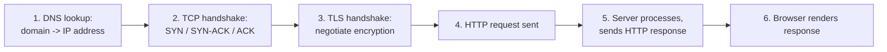

# Prerequisite Concepts, Part 3: Communication and Resilience

[Part 1](01_performance_and_scale.md) covered measurement and scaling; [Part 2](02_data_and_consistency.md)
covered data distribution. This part covers how machines actually talk to each other, and
the vocabulary for reasoning about what happens when a piece of that communication fails —
the last layer of shared assumptions every case study in this repo builds on.

## What Actually Happens When You Hit Enter

A classic warm-up question ("walk me through what happens when you type a URL and hit
enter") that's genuinely worth understanding, not just memorizing as an answer:

1. **DNS resolution**: the browser needs an IP address, not a domain name — it asks a DNS
   resolver, which (if not cached) walks a hierarchy of nameservers to find the IP address
   that domain currently points to.
2. **TCP handshake**: before any data flows, the client and server agree to a connection —
   the three-way handshake (`SYN` → `SYN-ACK` → `ACK`) establishes a reliable, ordered
   channel between them.
3. **TLS handshake** (for HTTPS): client and server negotiate encryption — exchange
   certificates, agree on a shared symmetric key — so everything sent afterward is
   encrypted in transit.
4. **HTTP request/response**: only now does the actual application-level request go out,
   and the server's response comes back over the already-established, already-encrypted
   connection.

**Why this matters beyond trivia**: every one of these steps adds latency *before any
actual application logic runs* — which is exactly why techniques like DNS caching, TLS
session resumption (skip re-negotiating on a reconnect), and HTTP keep-alive (reuse an
existing TCP connection for multiple requests instead of repeating the handshake every
time) exist. Understanding the stack tells you *where* a "why is this slow" investigation
should even look — a slow DNS resolver or an unnecessary TLS renegotiation can dominate a
latency budget that looks, from the application code's perspective, like a mystery.

## TCP vs. UDP

Two transport-layer protocols with a genuine, deliberate trade-off:

- **TCP**: connection-oriented, guarantees delivery, ordering, and error-checking — if a
  packet is lost, it's retransmitted; if packets arrive out of order, TCP reorders them
  before handing data to the application. The cost is overhead: the handshake, and the
  latency of waiting for retransmission when something is lost.
- **UDP**: connectionless, no delivery/ordering guarantees — packets are just sent, and if
  one is lost, nobody retransmits it automatically. The upside is speed and lower overhead:
  no handshake, no waiting on a lost packet before processing the next one.

**Why anyone chooses UDP given it's "less reliable"**: for some domains, a lost packet
that arrives late is *worse* than a lost packet that's simply skipped — video streaming and
real-time gaming are the canonical examples. A dropped video frame that arrives 500ms late
(after TCP retransmits it) is useless; you've already moved past that point in the
stream. Better to drop it and move on, which is exactly what UDP-based protocols do. TCP is
the correct default for almost everything else (HTTP, database connections, anything where
"the data must all arrive, correctly, in order" matters more than raw speed).

## Synchronous vs. Asynchronous Communication

- **Synchronous**: the caller sends a request and *blocks*, waiting for a response before
  doing anything else. Simple to reason about (linear, request-then-response), but the
  caller's own progress is now hostage to the callee's latency.
- **Asynchronous**: the caller sends a request and continues doing other work, handling the
  response later (via a callback, a promise/future, or a completely separate message when
  the work is done). More complex to reason about, but decouples the caller's throughput
  from the callee's latency.

**The direct link to the [message queue concept in
Fundamentals](../00_interview_framework/01_fundamentals.md#message-queues)**: a queue is the
infrastructure pattern that makes asynchronous communication reliable at scale — the
producer doesn't wait for the consumer to process a message, it just enqueues it and moves
on, and the queue absorbs the timing mismatch between how fast producers produce and how
fast consumers can keep up.

## Push vs. Pull

A related but distinct axis: **who initiates** the transfer of new information.

- **Pull (polling)**: the consumer repeatedly asks "is there anything new?" — simple, but
  wastes work on empty checks and has a latency floor equal to the polling interval (ask
  every 30 seconds, and worst-case you learn about new data 30 seconds late).
- **Push**: the producer proactively sends data the moment it's available — lower latency
  (no polling delay), but the producer now needs to track *who* to push to, and what
  happens if a consumer is temporarily unreachable.
- **Webhooks**: a specific, common push pattern for server-to-server communication — the
  consumer registers a URL, and the producer POSTs to it when an event happens, inverting
  the usual client-initiates-requests model.
- **Streaming**: a persistent, held-open connection (as opposed to discrete push
  notifications) over which a continuous flow of updates arrives — the mechanism underneath
  the [chat system case study's](../../system_design_practice/03_design_chat_system/tutorial.md#deep-dive-connection-management-at-scale)
  entire connection-management design, and the reason that case study is a genuinely
  different problem from a typical request/response API.

## Caching and Load Balancing, Briefly

Both covered in full depth in [Fundamentals](../00_interview_framework/01_fundamentals.md) — flagged
here only so the vocabulary is complete before you read further: **caching** trades
freshness for speed by storing frequently-accessed data closer to where it's needed (the
hard part is invalidation, not storage); **load balancing** distributes incoming requests
across multiple servers so no single one is overwhelmed (L4 balances on IP/port, L7 can
route on HTTP content like path or header).

## Resilience Vocabulary

The shared language for reasoning about what happens when a component fails — every case
study in this repo expects you to name these proactively, not just fix a failure once
asked "what if this breaks":

- **Single point of failure (SPOF)**: any component whose failure takes down the whole
  system, because nothing else can do its job. The first thing to look for when reviewing
  your own design — "what's the one box that, if it dies, everything stops?"
- **Redundancy**: having more than one of a component, so one failing doesn't remove the
  capability entirely — the general fix for a SPOF (multiple replicas, multiple availability
  zones, multiple regions).
- **Failover**: the *process* of switching from a failed component to a redundant one —
  redundancy is the "what" (having spares), failover is the "how" (actually cutting over to
  one when needed), and a failover process that's never been tested is a common,
  expensive-to-discover gap — see the [DR failover tricky
  scenario](../12_tricky_scenarios/12_dr_failover_slow.md) for exactly this failure mode
  playing out.
- **Circuit breaker**: a pattern that stops calling a dependency once it's clearly failing,
  instead of retrying into a struggling system and making things worse. Three states worth
  knowing by name: **closed** (normal operation, calls flow through), **open** (failures
  crossed a threshold, calls are rejected immediately without even attempting the
  dependency), **half-open** (after a cooldown, let a small number of calls through to test
  if the dependency has recovered, before fully closing again). This is the concrete
  mechanism behind "fail fast instead of piling on a struggling dependency."
- **Bulkhead**: named after ship design — a ship's hull is divided into watertight
  compartments so *one* compartment flooding doesn't sink the whole ship. Applied to
  systems: isolate resources (thread pools, connection pools) *per dependency*, so one
  overwhelmed downstream service exhausting its allotted resources doesn't starve requests
  to every *other*, healthy dependency sharing the same pool.
- **Graceful degradation**: losing functionality in a controlled, prioritized way under
  stress, rather than failing outright — e.g., a product page that can't reach the
  recommendations service still renders the product, just without a "you might also like"
  section, instead of failing the whole page load.

**Why this vocabulary matters as a set, not individually**: a mature production system
layers several of these together — a circuit breaker prevents hammering a failing
dependency, a bulkhead prevents that dependency's failure from starving unrelated request
paths, and graceful degradation defines what the user actually sees while all of this is
happening. Naming which of these applies to a specific failure mode, together, is what
turns "this could fail" into an actual design decision.

## Rate Limiting, Briefly

Covered as a full worked example in [Fundamentals](../00_interview_framework/01_fundamentals.md#worked-example-design-a-rate-limiter)
and extended to global/multi-region scale in the [staff-level rate limiter case
study](../../system_design_practice/07_design_rate_limiter_at_scale/tutorial.md) — flagged here for
completeness: the general purpose of a rate limiter is protecting a system's own
availability by rejecting or throttling excess load before it degrades service for
everyone, and it's one of the most common "design a small system" warm-up questions
precisely because it touches so much of this primer's vocabulary at once (throughput,
availability, the CAP-theorem trade-off of a distributed counter, and graceful degradation
under a fail-open-vs-fail-closed decision).

## Quick Self-Check

You've now covered the vocabulary every tutorial in this repo assumes. Before starting
[0. The Interview Framework](../00_interview_framework/00_interview_framework.md), you should be able to
answer:

- Why does understanding the DNS → TCP → TLS → HTTP sequence help you debug "why is this
  slow" beyond just profiling application code?
- Why is UDP a deliberate choice for some domains rather than simply "the worse protocol"?
- What's the difference between a circuit breaker and a bulkhead — what specific failure
  does each one prevent that the other doesn't?
- Why does a load balancer's L7 routing capability (from Fundamentals) depend on
  understanding that HTTP happens *after* the TCP/TLS handshake, not as part of it?

## Articulate It: Interview Framing & Vocabulary

### Three Ways to Explain This

- **Where-to-look framing (the default for 'why is this slow' debugging questions):** "I'd
  use the DNS-to-TCP-to-TLS-to-HTTP sequence as a checklist before touching application
  code — a slow DNS resolver or an unnecessary TLS renegotiation can dominate a latency
  budget that looks, from inside the app, like an unexplainable mystery."
- **Deliberate-trade-off framing (good for TCP vs. UDP):** "I wouldn't call UDP 'the less
  reliable protocol' — for video or real-time gaming, a packet that arrives late after
  retransmission is actually worse than one that's simply dropped, so UDP is a deliberate
  choice for that domain, not a compromise."
- **Layered-defense framing (good for resilience-pattern questions):** "I'd name these
  together, not individually — a circuit breaker stops hammering a failing dependency, a
  bulkhead stops that failure from starving unrelated request paths, and graceful
  degradation defines what the user actually sees while both are happening."

### Vocabulary Builder

**Technical shorthand — use these instead of over-explaining the concept every time:**

- **circuit breaker** (n. phrase) — a pattern with closed/open/half-open states that stops
  calling a clearly-failing dependency instead of retrying into it.
- **bulkhead** (n., from ship design) — isolating resources per-dependency so one
  overwhelmed downstream service can't starve requests to unrelated, healthy dependencies.
- **single point of failure (SPOF)** (n. phrase) — any component whose failure takes down
  the whole system because nothing else can do its job.
- **keep-alive** (n. phrase) — reusing an already-established TCP connection for multiple
  requests instead of repeating the handshake every time.

**Expressive phrases — for stating a trade-off fluently instead of listing pros/cons:**

- **"…is the how; …is the what"** — a clean template for separating a mechanism from the
  property it provides. *"Redundancy is the what — having spares; failover is the how —
  actually cutting over to one."*
- **"…that's never been tested is a common, expensive-to-discover gap"** — a fluent way to
  flag an unvalidated assumption (an untested failover path) as a real risk, not a
  formality.
- **hostage** (used figuratively) — *"Synchronous communication makes the caller's
  progress hostage to the callee's latency."* A vivid way to argue for decoupling.

---

**Previous:** [Part 2: Data & Consistency](02_data_and_consistency.md)  |  **Next:** [Part 4: CPU vs. GPU](04_cpu_vs_gpu.md)
